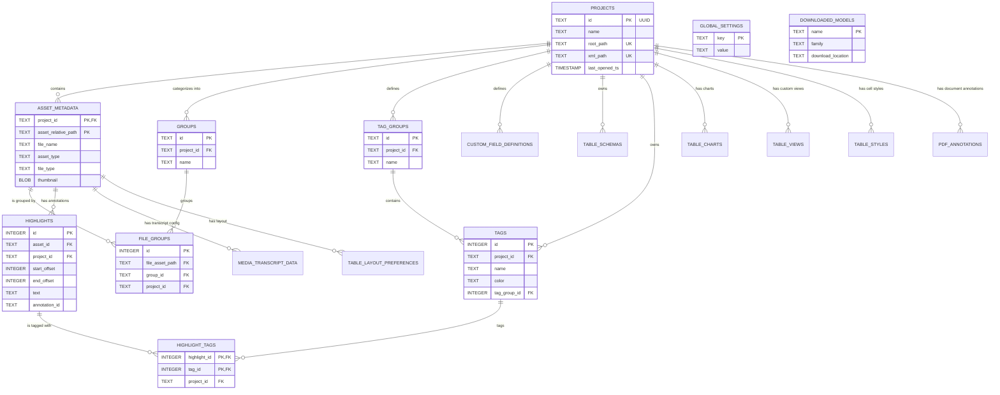

# Database Schema

**Purpose:** Documents the primary SQLite schema (`harvey.sqlite`) used by the Harvey application. This database acts as the central source of truth for projects, asset metadata, taxonomy (tags/groups), layouts, and configuration.

## Entity-Relationship Diagram

## Table Breakdown

### Core Hierarchy
*   **`projects`**: The root registry of all workspaces. Contains the canonical UUIDs (`id`) that link every other piece of data in the DB to a specific project scope. Tracks `last_opened_ts` to power the "Recent Projects" view.
*   **`asset_metadata`**: The central repository for all files tracked by a project (videos, audio, documents, tables, transcripts). Uses a composite primary key (`project_id`, `asset_relative_path`). It stores highly variable media metadata (codecs, framerates), custom JSON fields, cached waveform blob data, and thumbnails.
*   **`custom_field_definitions`**: Defines the schema for the dynamic key-value properties users can assign to files, enforcing types (e.g., text, number) and scopes across a project.

### Organization & Taxonomy
*   **`groups`**: User-defined folders or collections within a project.
*   **`file_groups`**: A relational mapping table placing specific `asset_metadata` rows into specific `groups`.
*   **`tag_groups`**: High-level categories (e.g., "Sentiment", "Speakers") to organize individual tags.
*   **`tags`**: Individual semantic labels (e.g., "Positive", "John Doe") with specific colors, globally available to a project.

### Annotations & Highlights
*   **`highlights`**: Represents a specific spatial or temporal selection within an asset (e.g., a text span in a transcript, a region in an image).
*   **`highlight_tags`**: A many-to-many mapping connecting `highlights` to `tags`.
*   **`pdf_annotations`**: A legacy/specialized table storing serialized JSON blobs of complex vector shapes or Lexical nodes specific to Documents, Images, and PDFs.

### Asset-Specific Configurations
*   **`media_transcript_data`**: Stores transcription-specific overrides (like language codes, initial prompts, or hotwords) for audio/video assets.
*   **`table_schemas`**: Serialized JSON defining the column types (e.g., Currency, Progress, DateTime) for CSV/XLSX assets.
*   **`table_styles`**: Saved cell/row background colors and text formatting for grid views.
*   **`table_charts`** & **`table_views`**: Serialized JSON configurations saving user-built graphs or Pivot Table layouts.
*   **`table_layout_preferences`**: State memory (like column widths or hidden columns) for grid views.

### Global Application State
*   **`global_settings`**: A simple key-value store for application-wide preferences (e.g., theme, download paths) that persist regardless of which project is open.
*   **`downloaded_models`**: A registry of local machine learning models (Faster-Whisper, Pyannote) available to the application.

## Conventions
*   **Foreign Keys (`FK`)**: Heavily utilizes `ON DELETE CASCADE`. If a `project` is deleted, its `asset_metadata`, `groups`, and `tags` are automatically wiped. If an `asset_metadata` row is deleted, its `file_groups` and `highlights` are wiped.
*   **Timestamps**: Almost all tables utilize `created_at` and `updated_at` columns, relying on SQLite `AFTER UPDATE` triggers defined in `db_handler.rs` to automatically keep `updated_at` current.
*   **Paths**: All paths stored in tables (except for `projects.root_path`) are stored as **relative paths** from the project root. This ensures that entire Harvey project folders can be moved on the file system without breaking database links.