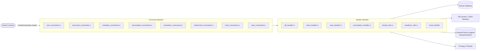

# Module: ProjectView

**Purpose:** Manages the core backend functionality for the Harvey application's Project Workspace, handling SQLite database interactions, file system operations, metadata management, complex data views (charts, pivots), and executing heavy operations like FFmpeg media trimming, Whisper transcriptions, and NLP translations.

## Architecture & Data Flow
*The flowchart below maps how frontend calls route through the command files down to the handlers, the database, the file system, and external Python processes.*

## Tauri IPC Commands (The API Surface)

### `core_commands.rs`
*   **`load_project_data(project_xml_path)`** -> `Result<ProjectViewData, CommandError>`: Loads the `.harvey` JSON manifest, auto-heals corrupted structures, and synchronizes the local SQLite database.
*   **`import_media(app_handle, source_file_path_str, project_xml_path_str, import_type)`** -> `Result<FileEntry, CommandError>`: Copies a media file into the project, extracts FFprobe metadata, and registers it in SQLite.
*   **`delete_project_item(item_path, project_xml_path)`** -> `Result<(), CommandError>`: Safely deletes files, directories, and associated SQLite metadata across all asset types.
*   **`rename_project_item(app_handle, item_path, new_name, project_xml_path)`** -> `Result<String, CommandError>`: Renames files/folders and updates SQLite keys. Emits an `item_renamed` event.
*   **`save_table_layout_prefs(project_id, table_path, layout_json)`** -> `Result<(), String>`: Saves Tabulator column layout configurations.
*   **`load_table_layout_prefs(project_id, table_path)`** -> `Result<Option<String>, String>`: Retrieves Tabulator column configurations.
*   **`create_new_group(project_id, name, description, file_asset_relative_path)`** -> `Result<GroupData, String>`: Creates a new user group and optionally associates an initial file.
*   **`rename_project_group(project_id, group_id, new_name, new_description)`** -> `Result<GroupData, String>`: Updates a group's naming metadata.
*   **`delete_project_group(project_id, group_id)`** -> `Result<(), String>`: Deletes a user group from the database.
*   **`update_group_details(project_id, group_id, name, description)`** -> `Result<GroupData, String>`: Updates group metadata properties.
*   **`get_groups_for_file_asset(project_id, file_asset_relative_path)`** -> `Result<Vec<GroupData>, String>`: Retrieves all groups an asset belongs to.
*   **`remove_file_from_group(project_id, group_id, file_asset_relative_path)`** -> `Result<(), String>`: De-links an asset from a group.
*   **`get_group_contents(project_xml_path_str, group_id)`** -> `Result<Vec<AssociatedFile>, String>`: Retrieves all physical files associated with a group.
*   **`get_project_groups(project_id)`** -> `Result<Vec<GroupData>, String>`: Retrieves all groups for a project.
*   **`save_pdf_metadata(project_id, asset_relative_path, thumbnail)`** -> `Result<(), String>`: Saves binary PDF thumbnail data.
*   **`reveal_in_file_explorer(app, file_path_str)`** -> `Result<(), CommandError>`: Opens the native OS file explorer (Finder/Explorer) to the target file.
*   **`export_project_manifest(project_id, manifest_path)`** -> `Result<(), CommandError>`: Triggers a sync of SQLite data to the `.harvey` JSON backup.

### `document_commands.rs`
*   **`save_note_json(target_path, json_content, highlights_json)`** -> `Result<(), String>`: Writes Lexical JSON to disk and saves associated highlights to DB.
*   **`load_note_json(file_path)`** -> `Result<String, String>`: Reads Lexical JSON from disk.
*   **`save_document_and_update_xml(project_xml_path, target_path, document_name, json_content)`** -> `Result<(), CommandError>`: Writes document JSON to disk and registers it in the `.harvey` manifest and DB.
*   **`load_document_metadata(project_xml_path_str, original_document_relative_path_str)`** -> `Result<Option<DocumentMetadata>, CommandError>`: Retrieves document metadata and highlights from DB.
*   **`read_file_content(path)`** -> `Result<String, CommandError>`: Generic text file reader.
*   **`delete_temporary_file(path)`** -> `Result<(), CommandError>`: Safely deletes `.tmp` files.
*   **`get_unique_document_path(target_dir_str, base_name, extension)`** -> `Result<String, CommandError>`: Increments filenames until a unique path is found.
*   **`create_new_document(project_xml_path, document_name)`** -> `Result<String, CommandError>`: Generates a blank Lexical structure and saves it as a new document.

### `metadata_commands.rs`
*   **`get_project_assets_for_link_command(project_id)`** -> `Result<Vec<ProjectAssetLinkOption>, String>`: Retrieves a flat list of assets for hyperlink autocomplete.
*   **`get_asset_metadata_command(app_handle, project_id, asset_relative_path)`** -> `Result<Option<FileMetadataWithCustomFieldsFromDb>, String>`: Gets core DB metadata, custom JSON fields, and transcript-specific properties.
*   **`update_asset_metadata_command(app_handle, project_xml_path_str, asset_relative_path, metadata_payload, custom_fields_payload, asset_type)`** -> `Result<(), String>`: Saves UI-edited metadata properties back to SQLite.
*   **`create_custom_field_definition_command(...)`** -> `Result<(), String>`: Defines a new custom metadata schema structure.
*   **`delete_custom_field_definition_command(...)`** -> `Result<(), String>`: Removes a custom schema definition.
*   **`get_all_custom_field_definitions_command(...)`** -> `Result<Vec<CustomFieldDefinition>, String>`: Fetches available custom schemas.

### `transcription_commands.rs`
*   **`trim_media(app_handle, original_media_path, start_time, end_time)`** -> `Result<Vec<FileEntry>, CommandError>`: Invokes FFmpeg to slice audio/video, generates new waveforms, and updates database relationships.
*   **`save_speaker_config(payload)`** -> `Result<(), CommandError>`: Updates speaker maps and custom names in the manifest.
*   **`load_transcript_json(transcript_path)`** -> `Result<String, CommandError>`: Specialized reader that validates Lexical JSON structure for transcripts.
*   **`save_transcript_json(...)`** -> `Result<(), CommandError>`: Specialized writer that parses Lexical JSON and maps its metadata appropriately.
*   **`transcribe_media_command(app_handle, payload, cancel_state)`** -> `Result<TranscriptionInitiatedPayload, CommandError>`: Complex orchestrator that converts media to WAV, invokes Python or Sidecar transcription engines (Whisper/Faster-Whisper) to generate word-level timestamps, performs high-precision diarization by re-clustering words into new segments based on speaker changes, and saves the output.
*   **`list_subtitle_files_command(media_path_str)`** -> `Result<Vec<SubtitleFileEntry>, CommandError>`: Scans for `.srt` and `.vtt` files.
*   **`convert_srt_to_vtt_command(srt_path_str)`** -> `Result<String, CommandError>`: Converts standard SubRip text to WebVTT.
*   **`convert_ass_to_vtt_command(ass_path_str)`** -> `Result<String, CommandError>`: Complex state machine converting Advanced SubStation Alpha styling and color tags into CSS-mapped WebVTT.
*   **`cancel_transcription(job_id, cancel_state)`** -> `Result<(), CommandError>`: Flags a running background transcription job for cancellation.
*   **`load_media_additional_parameters(...)`** / **`save_media_additional_parameters(...)`**: Manages hotwords and initial prompts for whisper.
*   **`start_live_transcription(...)`** -> `Result<bool, String>`: Spawns the `whisper-stream` sidecar to pipe realtime text chunks to the frontend.
*   **`stop_live_transcription(app_handle, state)`** -> `Result<bool, String>`: Kills the sidecar, executes `silenceremove` via FFmpeg, and automatically attaches the recording to the active document.

### `translation_commands.rs`
*   **`translate_transcript_command(...)`** -> `Result<TranslationInitiatedPayload, String>`: Translates the text column of a Lexical table.
*   **`translate_document_command(...)`** -> `Result<TranslationInitiatedPayload, String>`: Recursively translates all paragraphs/headings in a Lexical doc.
*   **`translate_standalone_transcript_command(...)`** -> `Result<TranslationInitiatedPayload, String>`: Translates an imported transcript.
*   **`cancel_translation_command(job_id, cancel_state)`** -> `Result<(), String>`: Cancels a background Python NLP job.

### `attachment_commands.rs`
*   **`upload_attachment(app_handle, project_xml_path_str, asset_relative_path, source_file_path_str)`** -> `Result<String, String>`: Copies a file into the project and registers it in the `attachments` array of `custom_fields_json`.
*   **`delete_attachment_command(...)`** -> `Result<(), String>`: Removes the physical file and de-links it from the DB.
*   **`get_base_asset_for_attachment(...)`** -> `Result<Option<String>, String>`: Reverse-lookups which primary asset owns an attachment path.

### `chart_commands.rs`
*   **`save_chart_config_command(...)`** -> `Result<ChartConfig, String>`: Serializes custom Recharts configurations into SQLite.
*   **`load_chart_configs_command(...)`** -> `Result<Vec<ChartConfig>, String>`: Deserializes charts.
*   **`delete_chart_config_command(...)`** -> `Result<(), String>`: Removes charts from DB.

### `view_commands.rs`
*   **`save_table_view_command(...)`** -> `Result<ViewConfig, CommandError>`: Serializes Tabulator filter/sort/pivot views.
*   **`load_table_views_command(...)`** -> `Result<Vec<ViewConfig>, CommandError>`: Deserializes views.
*   **`delete_table_view_command(...)`** -> `Result<(), CommandError>`: Removes views.
*   **`rename_table_view_command(...)`** -> `Result<(), CommandError>`: Renames a view.
*   **`generate_survey_documents_command(...)`** -> `Result<Vec<String>, CommandError>`: Powerful command that iterates over CSV rows and uses Handlebars templates to generate discrete `.json` Lexical documents for qualitative surveying.

## Internal Handlers
*These files encapsulate the business logic, keeping the command endpoints thin.*

*   **`db_handler.rs`**: Houses all `rusqlite` operations. Functions execute raw SQL queries for asset metadata, groups, PDF annotations, custom fields, and lexical highlights. Handles pooling and connection opening.
*   **`shared_utils.rs` / `utils.rs`**: Path canonicalization, file type determination from extensions, and OS-agnostic path handling.
*   **`chart_handler.rs`**: Wraps the DB queries specifically for the `chart_configs` table.
*   **`view_handler.rs`**: Wraps the DB queries for the `table_views` table and contains the heavy logic for Handlebars survey generation (`generate_survey_documents`).
*   **`waveform_utils.rs`**: Audio math. Takes raw PCM binary data, calculates peak averages in chunked windows, and outputs a reduced `Vec<u8>` array for frontend canvas rendering.
*   **`lexical_highlight_handler.rs`**: DB wrappers for the `lexical_highlights` SQLite table.
*   **`tag_handler.rs`**: DB wrappers for managing project-wide Tag taxonomy.
*   **`transcription_handler.rs`**: Legacy utilities for saving standalone transcripts and parsing older `.harvey.xml` schema mappings.
*   **`pdf_annotation_handler.rs`**: Wraps the DB queries for the `pdf_annotations` SQLite table.
*   **`local_handler/`**: Core integrations for launching the actual python processes (whisper, pyannote) and communicating over stdin/stdout.

## Managed State & Concurrency
*   **`tauri::State<'_, crate::TranscriptionCancellationState>`**: Uses `DashMap<String, Arc<AtomicBool>>` to thread-safely signal running asynchronous tokio tasks (FFmpeg, Python) to halt their loops and gracefully exit.
*   **`tauri::State<'_, crate::TranslationCancellationState>`**: A parallel `DashMap` specifically for Python translation processes.
*   **`tauri::State<'_, LiveTranscriptionState>`**: Holds `Mutex<Option<CommandChild>>` to manage the lifecycle of the `whisper-stream` sidecar process. Secures access to `active_document_path` and `start_time` while the stream is active.
*   **`tokio::spawn`**: Heavy tasks (like `run_translation_process` and `execute_transcription_pass`) are thrown onto the async tokio runtime so they don't block the main Tauri thread, emitting progress events back via `app_handle.emit()`.
*   **Database Pooling**: While some legacy endpoints open `rusqlite::Connection::open` locally, modern handlers are moving towards a managed connection pool approach for SQLite to prevent lock contention.

## Expected Errors
*   **`Result<T, String>`**: Simpler commands return stringified error messages directly to the Svelte frontend via the Tauri IPC bridge.
*   **`Result<T, CommandError>`**: Most complex commands return a custom `CommandError` enum (defined in `crate::welcome::config`). This implements `Serialize` and often carries variant types like `CommandError::Io(...)`, `CommandError::Message(...)`, or `CommandError::XmlDeserialization(...)` allowing the frontend to present precise toast notifications.
*   **Common Failures**:
    *   `"Project UUID is missing in the project file."` -> The `.harvey` JSON was corrupted or hasn't been upgraded.
    *   `"UNIQUE constraint failed: groups.project_id, groups.name"` -> User attempted to create a group with a duplicate name.
    *   `"Model directory not found: ..."` -> User attempts transcription/translation without downloading the PyTorch/GGUF model first.
    *   `"FFmpeg conversion failed. Code: Some(-1)"` -> Often indicates the user cancelled the process mid-stream via the UI flag.