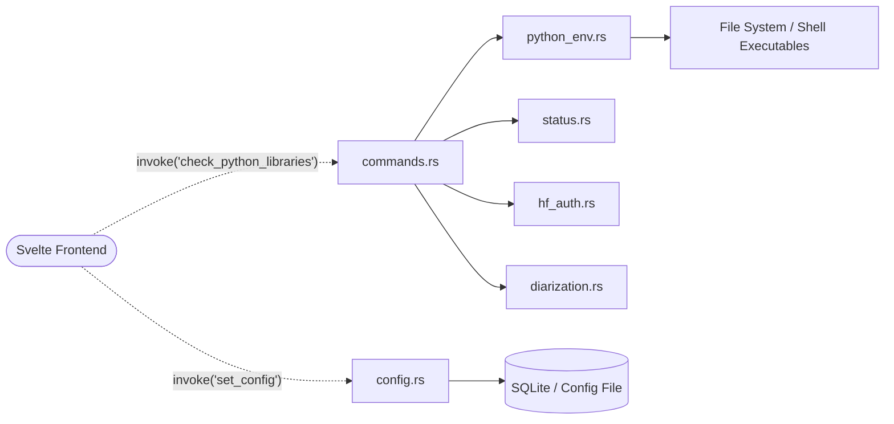

# Module: Welcome / Configuration (`src-tauri/src/welcome`)

**Purpose:** Handles global application configurations, environment bootstrapping, dependency verification (Python, FFmpeg, ML Models), and Hugging Face API authentication during the initial setup wizard or configuration view.

## Architecture & Data Flow
*Use a Mermaid flowchart to map how frontend calls route through the commands down to the handlers and external systems.*

## Tauri IPC Commands (The API Surface)
*List the `#[tauri::command]` functions defined in this module.*
*(Note: Most actual commands are exposed via `commands.rs` or directly registered in the `main.rs` plugin builder for this module).*
*   **`check_python_libraries(env_path)`** -> `Result<bool, String>`: Invokes `python_env.rs` to run a pip freeze and verify all required ML dependencies are installed locally.
*   **`save_hf_token(token)`** -> `Result<(), String>`: Invokes `hf_auth.rs` to securely validate and store a Hugging Face user access token required for pyannote diarization.
*   **`get_config()`** / **`set_config(payload)`** -> `Result<Config, String>`: Invokes `config.rs` to read/write the global application preferences (download paths, preferred engines).

## Internal Handlers
*   **`commands.rs`**: The primary API surface exposing Rust functions to the Svelte frontend.
*   **`config.rs`**: Defines the global `AppConfig` struct, default fallback values, and serialization/deserialization logic for the persistent configuration file.
*   **`python_env.rs`**: Logic to detect system Python paths, create virtual environments, and manage **Hardware-Aware installations**. This includes automatically detecting NVIDIA GPUs to install CUDA-optimized variants of PyTorch and `whisper.cpp`, or selecting Intel MKL-optimized binaries on Windows x86_64 for maximum CPU performance.
*   **`hf_auth.rs`**: Validates Hugging Face tokens by making a lightweight HTTP request to the HF Hub API before saving them.
*   **`status.rs`**: Aggregates the various checks (Python, Models, FFmpeg, Config) into a unified `ConfigStatus` struct sent to the Svelte store on app launch.
*   **`diarization.rs`**: Specific setup and validation logic for downloading and verifying the `pyannote/speaker-diarization` models.

## Expected Errors
*   **`DependencyError`**: Returns a string error if Python or FFmpeg is not found in the system `$PATH`.
*   **`NetworkError`**: Fails during model downloads or HF token validation if the machine lacks internet access.
*   **`ConfigWriteError`**: Fails if the application lacks permissions to write to the designated local `app_data_dir` configuration file.