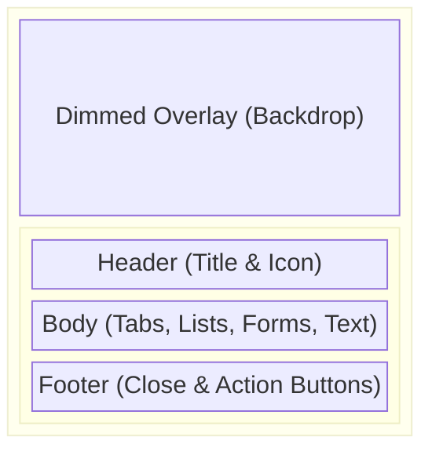
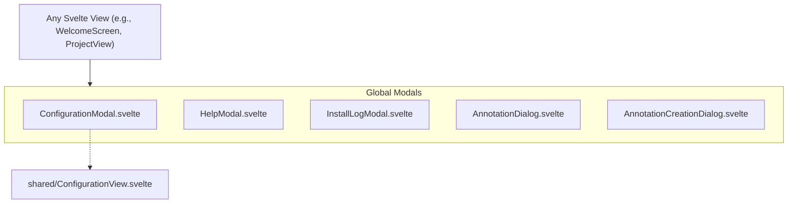

# Global Modals

**Purpose:** Houses global, application-wide modal dialog components that are not inherently tied to a specific sub-view like `projectview` or `welcome`, but can be invoked from anywhere.

## Visual Wireframe

## Component Architecture

## Props / Inputs

Most modals share a common activation prop:

- **`showModal`** (`boolean`): Toggles the visibility of the modal. Typically bound (`bind:showModal`) to the parent component.
- **`isCompact`** (`boolean`, Optional): Present on modals like `HelpModal` to adjust sizing/padding based on the invoking context.

## State & Context (Svelte Stores)

- **Local State:** Modals manage their own internal form states, active tabs (like in `HelpModal`), and input bindings.
- **Global Stores:**
  - `$configStatus`: Read by `ConfigurationModal` and `InstallLogModal` to reflect the current installation states of Python dependencies and AI models.

## Backend & Database Interop (Tauri IPC)

- **Tauri Commands Triggered:** These modals often serve as wrappers around complex backend logic or invoke `shell` commands (like installing pip dependencies or tailing logs in `InstallLogModal`).
- **Data Flow:** They emit custom Svelte events (`dispatch('close')`, `dispatch('confirm')`) to pass processed data or actions back to the invoking parent.

## Child Components

- **`ConfigurationModal.svelte`:** A wrapper modal that injects the shared `ConfigurationView.svelte` directly over the current screen, allowing users to configure the application without leaving their active project.
- **`HelpModal.svelte`:** A tabbed interface providing documentation, keyboard shortcuts, version info, and support links.
- **`InstallLogModal.svelte`:** A specialized console-style modal that displays real-time `stdout`/`stderr` from Tauri shell commands (e.g., during Python setup or Model downloads) via event listeners.
- **`AnnotationDialog.svelte` / `AnnotationCreationDialog.svelte`:** Dialogs for creating and viewing global PDF or Document annotations.

## Expected Behaviors & Edge Cases

- **Event Dispatching:** Follows the `on:close` pattern to allow parents to reset their `showModal` state. They do not mutate parent state directly unless strictly using `bind:`.
- **Z-Index:** Configured with high z-indexes (e.g., `z-[10000]`) to float above all other UI elements, including Lexical overlays and other nested components.
- **Click Outside/Esc:** Generally utilize Flowbite's `outsideclose={true}` where appropriate, though critical configuration dialogs may force manual closures.
