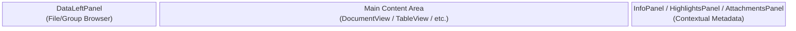
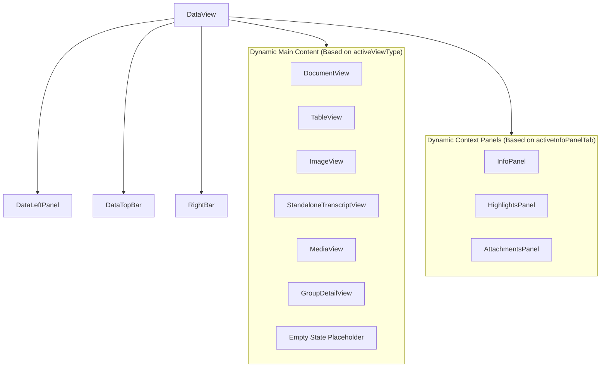

# Data View Orchestrator (`DataView.svelte`)

**Purpose:** Acts as the central orchestrator for the Data tab, managing the layout between the file browser (left panel), the main content viewer (middle panel), and contextual information panels (right panels), while handling routing and state synchronization for various file types.

## Visual Wireframe

## Component Architecture

## Props / Inputs
* **`activeSubItemPath`** (`String | null`): Sub-item context for nested Lexical views (e.g., cell content within a TableView).
* **`activeSubItemType`** (`String | null`): The specific type of the active sub-item (e.g., 'view', 'doc').
* **`tableViewRef`** (`Object`): Bound reference to the child `TableView` instance, used to trigger internal methods like `getExportData()` and `openView()`.
* **`imageViewRef`** (`Object`): Bound reference to the child `ImageView` instance, used to trigger `triggerExport()`.
* **`documentViewRef`** (`Object`): Bound reference to the child `DocumentView` instance, used to trigger insertions and media playback.
* **`standaloneTranscriptViewRef`** (`Object`): Bound reference to the child `StandaloneTranscriptView` instance.

## State & Context (Svelte Stores)
* **Local State:** `activeViewType`, `activeItemPath`, `activeItemTypeForInfoPanel`, `infoPanelRefreshKey`, `highlightsPanelRefreshKey`, `attachmentsPanelRef`.
* **Global Stores:**
  * `$project` (`$lib/stores/projectStore.js`): Subscribes to changes in selected documents, media notes, and groups to determine `activeItemPath` and `activeViewType`.
  * `$panelStateStore` (`$lib/stores/panelStateStore.js`): Controls visibility and width of left/right panels (`dataLeftPanelCollapsed`, `infoPanelCollapsed`, `activeInfoPanelTab`).
  * `refresher` (`$lib/stores/refresherStore.js`): Subscribes to refresh triggers to update components like `HighlightsPanel`.

## Backend & Database Interop (Tauri IPC)
* **Tauri Commands Triggered:**
  * `listen('metadata_updated')`: Listens for backend events to refresh the InfoPanel when metadata changes.
  * `listen('live_transcription_result')` (in `DataTopBar.svelte`): Receives live transcription text segments.
  * `invoke('delete_project_group')` (in `DataLeftPanel.svelte`): Deletes a group folder structure.
  * `invoke('reveal_in_file_explorer')` (in `DataLeftPanel.svelte`): Opens native OS file explorer to a specific asset.
  * `invoke('delete_project_item')` (in `DataLeftPanel.svelte`): Deletes a specific item and reverts its database entry during an aborted import.
  * `invoke('add_file_to_existing_group')` (in `DataLeftPanel.svelte`): Associates a file asset with a group database row.
  * `invoke('set_table_headers')` (in `DataLeftPanel.svelte`): Flags a CSV/XLSX table as having headers during import.
  * `invoke('rename_project_group')` (in `DataLeftPanel.svelte`): Updates a group's name and description.
  * `invoke('load_transcript_json')` (in `DataTopBar.svelte`): Retrieves transcript JSON for exporting.
  * `invoke('start_live_transcription')` (in `DataTopBar.svelte`): Initiates the Rust backend live transcription model process.
  * `invoke('stop_live_transcription')` (in `DataTopBar.svelte`): Halts the active live transcription process.
  * `invoke('load_table_views_command')` (in `TopBarTableViewsDropdown.svelte`): Retrieves associated custom table views (partial, pivot, survey).
  * `invoke('get_asset_metadata_command')` (in `TopBarTableViewsDropdown.svelte`): Retrieves custom fields (like survey attachments) for a specific asset.
* **Data Flow:** `DataView.svelte` acts as a reactive router. When `$project.selectedDocumentPath` (or media/transcript paths) changes, it updates `activeItemPath` and `activeViewType`, which dynamically mounts the correct child component (e.g., `TableView` vs `DocumentView`) in the main content area. Component events (like `requestviewchange`) are dispatched upwards or handled to mutate the `$project` store, creating a unidirectional flow of state.

## Child Components
* **`DataLeftPanel`** (`./DataLeftPanel.svelte`): The collapsible file and group browser that categorizes assets and handles context menus and imports.
* **`DataTopBar`** (`./DataTopBar.svelte`): The top toolbar for actions like exporting, toggling split views, layout changes, and live transcription.
* **`DataMiddlePanel`** (`./DataMiddlePanel.svelte`): A minimal Lexical editor test/wrapper.
* **`TopBarTableViewsDropdown`** (`./TopBarTableViewsDropdown.svelte`): A specialized dropdown rendered in the top bar for selecting table views (e.g., pivot tables, surveys).
* **`DocumentView`** (`./documents/DocumentView.svelte`): Renders standard text and Lexical JSON documents.
* **`TableView`** (`./tables/TableView.svelte`): Renders spreadsheet data (CSV, XLSX).
* **`ImageView`** (`./images/ImageView.svelte`): Renders supported image assets.
* **`StandaloneTranscriptView`** (`./standalone_transcripts/StandaloneTranscriptView.svelte`): Renders isolated transcript files without accompanying media.
* **`MediaView`** (`./media/MediaView.svelte`): Renders audio/video files with associated interactive transcripts.
* **`GroupDetailView`** (`./groups/GroupDetailView.svelte`): Renders the contents and metadata of a selected group.
* **`InfoPanel`** (`./shared_panels/InfoPanel.svelte`): Renders editable metadata and custom fields for the active asset.
* **`HighlightsPanel`** (`./shared_panels/HighlightsPanel.svelte`): Renders extracted highlights and tags from the active document/transcript.
* **`AttachmentsPanel`** (`./shared_panels/AttachmentsPanel.svelte`): Renders sub-files and attachments linked to the active document.
* **`RightBar`** (`./shared_panels/RightBar.svelte`): The narrow far-right vertical tab bar used to toggle between `InfoPanel`, `HighlightsPanel`, and `AttachmentsPanel`.

## Expected Behaviors & Edge Cases
* **`requestviewchange` Action:** When an item is clicked in `DataLeftPanel`, it emits a `requestviewchange` event containing the path and type. `DataView` intercepts this, checks for unsaved changes using `checkUnsavedChangesThenProceed`, and conditionally dispatches Svelte store helper methods (`prepareDocumentView`, `prepareMediaNoteView`) to mutate the global state, triggering the reactive component switch.
* **Attachment Routing:** When an attachment view is requested (e.g., opening a sub-item from a table survey), `DataView` awaits a UI tick before instructing `panelStateStore` to open the `attachments` tab and invoking the child `tableViewRef` to handle the specific document loading logic.
* **Autosave Debouncing:** `DataTopBar.svelte` actively monitors store dirty flags (`isDocumentDirty`, `isPdfAnnotationsDirty`, `isMediaNoteTranscriptDirty`) and triggers backend save actions after a 3000ms debounce period to ensure continuous persistence.
* **Empty/Null State:** If no file is selected (`activeViewType === 'placeholder'`), a central message ("Select an item from the Data panel to view or edit") is rendered.
* **Unsupported File Path:** If the `$project.selectedDocumentPath` contains an unrecognized extension, `activeViewType` defaults to `placeholder`, rendering an invalid item message.
* **Complex Media Interception:** If a `requestviewchange` is triggered for an `audio_transcript` or `video_transcript` directly from a table attachment, `DataView` forwards the event out to the top-level `ProjectView.svelte` orchestrator to ensure the entire parent media player is accurately initialized.
