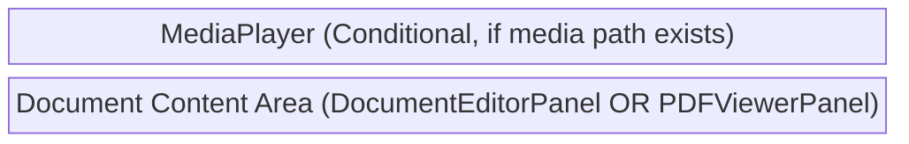
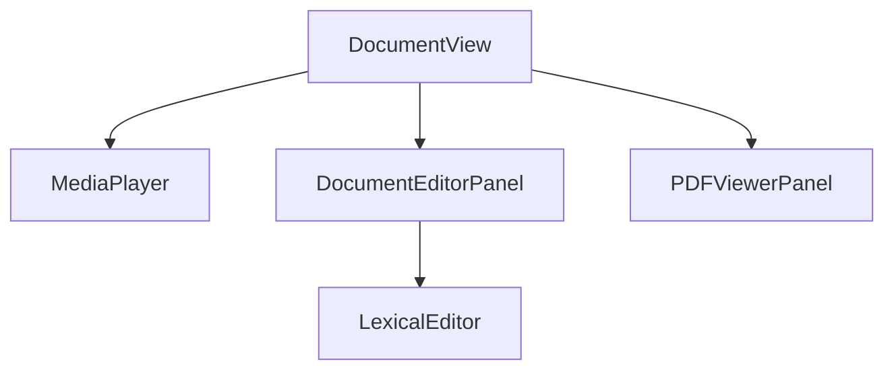

# Document View Components (`documents/`)

**Purpose:** Renders, edits, and manages document files (Lexical JSON, PDFs) within the Data tab, including text highlighting, annotations, and media playback synchronization.

## Visual Wireframe

## Component Architecture

## Props / Inputs
* **`DocumentView.svelte`**:
  * **`itemPath`** (`String | null`): The absolute or relative path to the document file.

* **`DocumentEditorPanel.svelte`**:
  * **`highlightedRowIndex`** (`Number`): The row index to externally highlight/focus within the Lexical editor.

* **`PDFViewerPanel.svelte`**:
  * **`pdfPath`** (`String`): The path to the PDF file to load.
  * **`initialHighlights`** (`Array`): An array of pre-existing highlight objects to render on the PDF.

## State & Context (Svelte Stores)
* **Local State:**
  * `DocumentView`: `mediaPath`, `attachments`, `isVideoHidden`, `currentTime`, `isPlaying`.
  * `DocumentEditorPanel`: `editorJsonState`, `currentJson`, `initialJson`, `isDirty`, `isLoading`, `errorMessage`, `initialHighlights`.
  * `PDFViewerPanel`: `pdfDoc`, `pdfViewer`, `eventBus`, `numPages`, `currentPageNum`, `currentScaleValue`, `showSelectionToolbar`, `toolbarMode`, `selectedRange`, `undoStack`, `redoStack`, `searchQuery`.
* **Global Stores:**
  * `$project` (`$lib/stores/projectStore.js`): Subscribes to document paths, highlights, JSON state, and dirty flags. Updates `currentDocumentHighlights` and active editor refs.
  * `$isLexicalEditMode` (`$lib/stores/mediaEditorStore.js`): Determines if the Lexical editor is in read or edit mode.
  * `$allTags`, `$allTagGroups` (`$lib/stores/tagStore.js`): Used for assigning tags to PDF highlights.

## Backend & Database Interop (Tauri IPC)
* **Tauri Commands Triggered:**
  * `invoke('get_asset_metadata_command')` (in `DocumentView.svelte`): Retrieves custom fields (like attachments) to determine if media should be played alongside the document.
  * `invoke('load_lexical_highlights')` (in `DocumentEditorPanel.svelte`): Fetches saved highlights for the Lexical document.
  * `readFile(pdfPath)` (in `PDFViewerPanel.svelte`): Uses `@tauri-apps/plugin-fs` to load the PDF binary data.
  * (Implicitly via services): `saveDocumentContent`, `saveCurrentPdfAnnotations` trigger backend save commands.
* **Data Flow:** `DocumentView` receives the `itemPath`, determines the file type, and mounts either `DocumentEditorPanel` or `PDFViewerPanel`. State changes (like editing text or adding a PDF highlight) are synced to the local `$project` store and then debounced or explicitly saved via Tauri commands.

## Child Components
* **`MediaPlayer`** (`../shared/MediaPlayer.svelte`): Plays audio/video associated with the document via attachments.
* **`DocumentEditorPanel`** (`./DocumentEditorPanel.svelte`): Wraps the Lexical rich text editor for `.json` document editing.
* **`PDFViewerPanel`** (`./PDFViewerPanel.svelte`): A custom wrapper around `pdfjs-dist` that renders PDFs and provides a custom text-selection and highlighting toolbar.
* **`LexicalEditor`** (`../../lexical/LexicalEditor.svelte`): The core rich text editor component.

## Expected Behaviors & Edge Cases
* **File Type Routing:** `DocumentView` checks the `itemPath` extension. `.pdf` loads `PDFViewerPanel`, `.json` loads `DocumentEditorPanel`. Unrecognized types render an empty state message.
* **Lexical Autosave:** `DocumentEditorPanel` sets itself as the `activeDocumentEditorRef` in the project store. The parent `DataTopBar` triggers `save()` on this ref when changes are detected.
* **PDF Highlight Persistence:** When a user selects text and applies a color in `PDFViewerPanel`, it generates quad points, renders an overlay, and dispatches a `pdfhighlightevent`. `DocumentView` intercepts this to update `$project.currentDocumentHighlights`, which marks the PDF annotations as dirty for autosaving.
* **PDF Worker Matching:** If a PDF highlight lacks geometric `quadPoints` (e.g., from a legacy save), `PDFViewerPanel` dispatches a web worker (`pdfAnnotationMatcher.worker.js`) to perform a fuzzy text match against the page's text content and recover the coordinates.
* **Undo/Redo (PDF):** `PDFViewerPanel` maintains custom `undoStack` and `redoStack` arrays for highlight additions, removals, and color changes, intercepting standard keyboard shortcuts (`Cmd+Z`, `Cmd+Y`).
