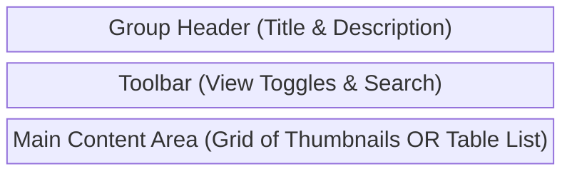
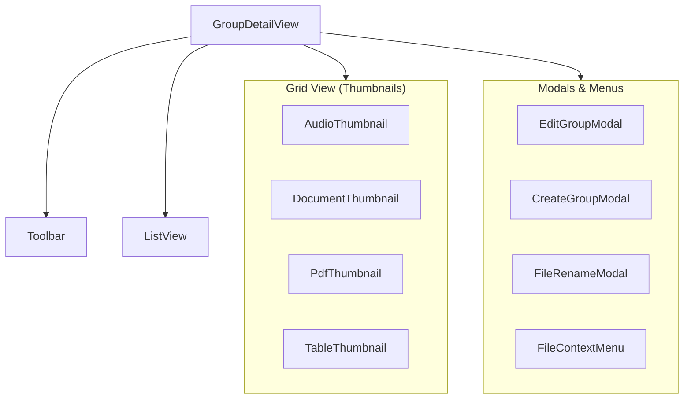

# Groups View Components (`groups/`)

**Purpose:** Renders the contents and metadata of a user-defined group of assets, providing grid and list views with file-specific thumbnails and context actions.

## Visual Wireframe

## Component Architecture

## Props / Inputs
* **`GroupDetailView.svelte`**:
  * **`groupData`** (`Object`): Expected `{ id, name, description, project_id }`. The metadata of the group to display.
* **Thumbnail Components** (`AudioThumbnail.svelte`, `DocumentThumbnail.svelte`, etc.):
  * **`file`** (`Object`): The file asset metadata object from the database.
  * **`isTranscript`** (`Boolean` - *DocumentThumbnail only*): Adjusts visual rendering if the file is a standalone transcript.

## State & Context (Svelte Stores)
* **Local State:**
  * `GroupDetailView`: `categorizedFiles`, `allFiles`, `searchQuery`, `sortKey`, `sortDirection`, `columns`, `contextMenuVisible`, `itemToRename`.
* **Global Stores:**
  * `$projectStore` (`$lib/stores/projectStore.js`): Uses `xmlPath` and `id` to fetch group contents and responds to `$groupContentNotification`.
  * `$panelStateStore` (`$lib/stores/panelStateStore.js`): Reads `groupDetailViewMode` to toggle between 'grid' and 'list' layout.
  * `currentProjectGroupsList`: Used to populate the "Add to Group" submenu.

## Backend & Database Interop (Tauri IPC)
* **Tauri Commands Triggered:**
  * `invoke('get_group_contents')` (in `GroupDetailView.svelte`): Fetches the list of files associated with the active group.
  * `invoke('remove_file_from_group')` (in `GroupDetailView.svelte`): De-links an asset from the group.
  * `invoke('reveal_in_file_explorer')` (in `GroupDetailView.svelte`): Opens the OS file manager to the file.
  * `invoke('add_file_to_existing_group')` (in `GroupDetailView.svelte`): Links an asset to a different group via the submenu.
  * `invoke('read_file_content')` (in `DocumentThumbnail.svelte`): Reads the raw JSON of a Lexical document or transcript to extract a text preview.
* **Data Flow:** `GroupDetailView` watches the `groupData` prop. When it changes, it triggers `get_group_contents`, categorizes the returned array (audios, videos, documents, etc.), and renders them. If a file is manipulated via context menus (rename, delete, remove), backend services are called and the local list is re-fetched.

## Child Components
* **`AudioThumbnail.svelte`**: Renders an HTML5 `<canvas>` waveform using the pre-calculated `waveform_data` byte array.
* **`DocumentThumbnail.svelte`**: Parses Lexical JSON strings into a miniature, un-editable visual representation of the document structure.
* **`PdfThumbnail.svelte`**: Renders a thumbnail of a PDF file (implementation relies on external PDF.js workers).
* **`TableThumbnail.svelte`**: Renders a stylized icon/preview for CSV/XLSX files.
* **`EditGroupModal`, `CreateGroupModal`, `FileRenameModal`, `FileContextMenu`**: Shared modals and menus for asset manipulation.

## Expected Behaviors & Edge Cases
* **File Double Click:** Double-clicking a file thumbnail or list row triggers the Svelte store router (`prepareDocumentView`, `prepareMediaNoteView`) to open the file in the main Data tab, effectively exiting the group view.
* **Column Persistence:** In list view, the visibility state of columns is saved to `localStorage` (`harveyGroupListColumns`) and restored on mount.
* **Waveform Extraction:** `AudioThumbnail.svelte` detects if the database `waveform_data` is a `Uint8Array` or `Float32Array` and normalizes the peaks to fill 80% of the canvas height. It only renders the first ~10 seconds of audio to act as a preview.
* **Resilient JSON Parsing:** `DocumentThumbnail.svelte` attempts to parse Lexical structure (tables, paragraphs, headings). If the strict structure fails, it falls back to a `hyperResilientExtract` function to pull any flat text out of the JSON object to ensure a preview is always generated.
