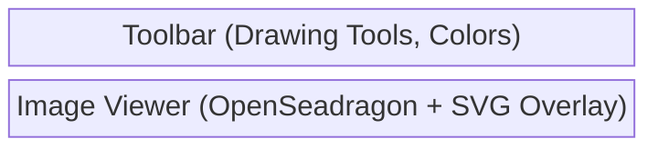
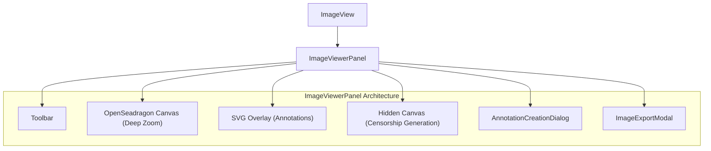

# Image View Components (`images/`)

**Purpose:** Renders supported image formats using OpenSeadragon, providing deep zoom capabilities and a robust custom SVG overlay system for drawing and editing annotations (rectangles, circles, polygons, speech bubbles, censorship pixelation).

## Visual Wireframe

## Component Architecture

## Props / Inputs
* **`ImageView.svelte`**:
  * **`itemPath`** (`String | null`): The absolute path to the image file.
* **`ImageViewerPanel.svelte`**:
  * **`imagePath`** (`String`): The path passed down from `ImageView`.
* **`AnnotationDialog.svelte`** (Legacy/Basic Dialog):
  * **`showDialog`**, **`popupStyle`**, **`initialTitle`**, **`initialDescription`**, **`initialColor`**, **`highlightOptions`**.

## State & Context (Svelte Stores)
* **Local State (`ImageViewerPanel`):**
  * `osdViewer`: The OpenSeadragon instance.
  * `currentAssetUrl`, `pixelatedAssetUrl`: Data URLs for the main image and its low-res pixelated version.
  * `activeDrawingTool`: 'rectangle', 'circle', 'polygon', 'speech-bubble-rect', 'text-area', 'censored', etc.
  * `isDrawing`, `isDraggingShape`, `isDraggingResizeHandle`, `isDraggingTail`: Flags for mouse interactions.
  * `selectedAnnotationId`, `annotationBeingEdited`: Tracks which annotation is active in the UI or dialog.
* **Global Stores:**
  * `$project` (`$lib/stores/projectStore.js`): Subscribes to `$project.currentImageAnnotations`. Dispatches updates back via `updateImageAnnotations`.
  * `$isLexicalEditMode` (`$lib/stores/mediaEditorStore.js`): Determines if annotation creation/editing tools (like text areas and speech bubbles) are enabled.

## Backend & Database Interop (Tauri IPC)
* **Tauri Commands Triggered:**
  * (Implicitly via services): `saveImageAnnotations` is called sequentially after every annotation creation, modification, or deletion.
  * `@tauri-apps/plugin-fs`: `writeFile` is used during image export to save the flattened canvas data to the local filesystem.
* **Data Flow:** `ImageView` receives the path and mounts `ImageViewerPanel`. The panel initializes OpenSeadragon using `convertFileSrc` to load the local file. The SVG overlay reactively maps `$currentAnnotations` to DOM elements. Mouse events on the SVG/OSD canvas calculate coordinates relative to the viewport (normalized 0-1 mapped to a 1000x1000 SVG coordinate space) and update the local store, immediately triggering a backend save.

## Child Components
* **`ImageViewerPanel.svelte`**: The core workhorse handling the OpenSeadragon instance, mouse math for drawing, SVG overlay rendering, and export logic.
* **`AnnotationCreationDialog.svelte`** (Imported from `$lib/components/modals/`): Advanced dialog for editing annotation text, HTML formatting, colors, and borders.
* **`AnnotationDialog.svelte`**: A basic/legacy version of the dialog (kept for reference or fallback).
* **`ImageExportModal.svelte`**: Allows the user to select export options (e.g., flatten with annotations).

## Expected Behaviors & Edge Cases
* **Deep Zoom Integration:** Annotations are rendered as an SVG overlay positioned precisely over the OpenSeadragon canvas. As OSD zooms and pans, the SVG scales natively, preventing pixelation of vector paths.
* **Coordinate System:** Shape coordinates are stored in a normalized format. The SVG `viewBox` is set to `0 0 1000 1000`, and coordinates from the store are multiplied by `1000` (e.g., `x = shapeData.x * 1000`) for rendering.
* **Hardware Rendering Bug Workaround:** During image export (`handleExportImage`), speech bubbles and complex HTML text annotations are drawn to an offscreen canvas first, strictly segregating `fillRect` and `fillText` passes. This prevents a known WebView2 stencil buffer corruption bug where highlighted text inside polygons turns invisible.
* **Censorship (Pixelation):** When an image loads, a hidden canvas generates a 50px wide low-res version of the image. The SVG overlay uses this low-res data URL as an `<pattern>` fill for 'censored' shapes, scaling it up to create genuine block pixelation that protects sensitive data.
* **Tail Dragging Math:** For speech bubbles, dragging the "tail" dynamically calculates intersections with the parent boundary (rectangle or circle) to keep the bubble visually coherent.
