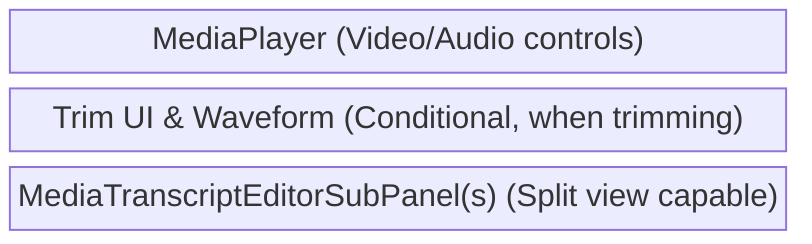
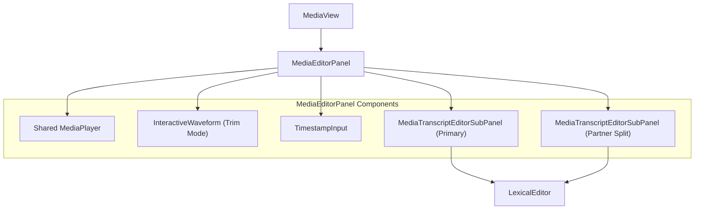

# Media View Components (`media/`)

**Purpose:** Provides a synchronized playback and editing environment for audio and video assets alongside their associated interactive transcripts, supporting split-view comparisons and media trimming.

## Visual Wireframe

## Component Architecture

## Props / Inputs
* **`MediaView.svelte`**:
  * **`itemPath`** (`String | null`): The absolute path to the media file.
* **`MediaEditorPanel.svelte`**:
  * **`mediaPath`** (`String | null`): Passed down from `MediaView`.
* **`MediaTranscriptEditorSubPanel.svelte`**:
  * **`mediaPath`** (`String | null`): The path of the active media file.
  * **`transcriptPath`** (`String | null`): The path of the specific JSON transcript to load.
  * **`isPrimary`** (`Boolean`): Flags if this panel is the main view or a split partner.
  * **`enableSegmentPlayback`** (`Boolean`): Toggles click-to-play functionality on transcript segments.
  * **`highlightedRowIndex`** (`Number`): The row index to externally highlight/focus within the Lexical editor.

## State & Context (Svelte Stores)
* **Local State (`MediaEditorPanel`):** `isDataPlayerVideoHidden`, `showDataTrimUI`, `currentTrimAudioBuffer`, `currentTrimAudioPeaks`, `dataTrimStartTime`, `dataTrimEndTime`, split-view row counts, and scroll sync toggles.
* **Global Stores:**
  * `$project` (`$lib/stores/projectStore.js`): Uses `activeTranscriptPathInDataTab` and `standaloneTranscriptSplits` to determine which transcripts to render and if split-mode is active. Tracks dirty states (`isMediaNoteTranscriptDirty`).
  * `$isMediaEditorOpen` (`$lib/stores/mediaEditorStore.js`): Set to `true` on mount to inform the rest of the app (like `DataTopBar`) that media layout options are relevant.
  * `$isLexicalEditMode` (`$lib/stores/mediaEditorStore.js`): Controls whether the transcript is editable or strictly in read/highlight mode.

## Backend & Database Interop (Tauri IPC)
* **Tauri Commands Triggered:**
  * `invoke('load_transcript_json')` (in `MediaTranscriptEditorSubPanel`): Fetches the textual content of the transcript.
  * `invoke('load_lexical_highlights')` (in `MediaTranscriptEditorSubPanel`): Fetches saved highlight data for the transcript.
  * (Implicitly via services): `handleTrimMediaConfirm` invokes backend FFmpeg commands to slice the media file and generate new database records. `saveDocumentContent` saves transcript modifications.
* **Data Flow:** `MediaView` routes the `itemPath` to `MediaEditorPanel`. The panel initializes the shared `MediaPlayer` and mounts one or two `MediaTranscriptEditorSubPanel`s based on the global split state. Changes made in the Lexical editor are immediately synced to the `$project` store. When a user clicks a timestamp in the transcript, it emits a `playsegment` event that the panel catches and routes back into the `MediaPlayer.seekTo()`.

## Child Components
* **`MediaEditorPanel.svelte`**: The core controller linking media playback to transcript rendering, handling trim state, and managing split-screen scroll synchronization.
* **`MediaTranscriptEditorSubPanel.svelte`**: A targeted wrapper for the Lexical editor specifically tuned for loading, rendering, and saving transcript JSON structures, including error states for missing files.
* **`MediaPlayer` & `InteractiveWaveform`** (`../shared/`): Shared media components handling raw playback and visual waveform rendering during trim operations.

## Expected Behaviors & Edge Cases
* **Scroll Synchronization:** When a split view is active (two transcripts visible), `MediaEditorPanel` attaches event listeners to both scrollable areas. Scrolling or clicking in one panel automatically scrolls the other to the matching row index. If row counts differ significantly, a warning banner is displayed.
* **Trim Mode:** Clicking "Trim" in the media player minimizes the player, exposes a visual waveform, and allows the user to define a start and end time. Confirming triggers a heavy backend FFmpeg operation, updating the UI with a spinner.
* **Missing Transcripts:** If a media file is selected but no transcript exists, the `MediaTranscriptEditorSubPanel` gracefully catches the "FILE_NOT_FOUND" error and renders a friendly "No Transcription Yet" placeholder instead of crashing.
* **Autosave Integration:** Edits made in the sub-panel update the local Svelte store synchronously to avoid jitter, but defer heavy file-write operations (`saveDocumentContent`) until debounced by the parent `DataTopBar` or explicitly saved on tab switch.
