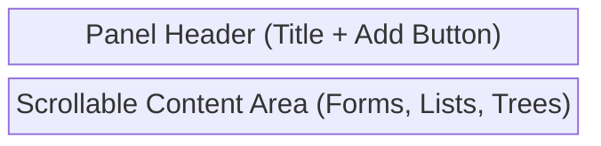
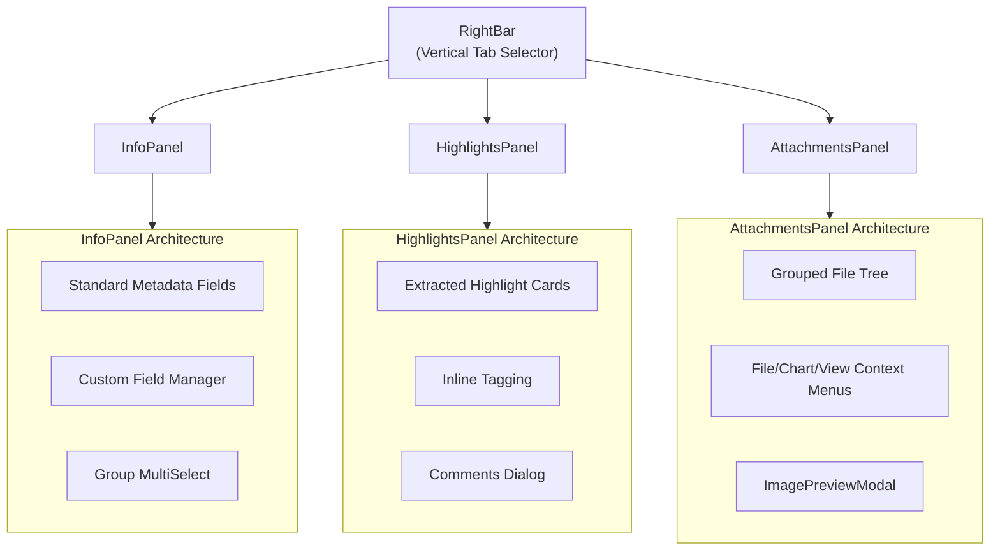

# Shared Panels Components (`shared_panels/`)

**Purpose:** Provides contextual, right-aligned sidebars for displaying and managing metadata, extracted highlights, tags, comments, and file attachments associated with the actively selected document, table, media, or transcript.

## Visual Wireframe

## Component Architecture

## Props / Inputs

- **`InfoPanel.svelte` / `HighlightsPanel.svelte` / `AttachmentsPanel.svelte`**:
  - **`itemPath`** (`String | null`): The absolute or relative path of the active item.
  - **`itemType`** (`String | null`): The type of the active item (e.g., 'doc', 'media', 'table', 'pdf').
  - **`refreshKey`** (`Number | null`): A reactive trigger updated by the parent `DataView` to force a data reload without unmounting the component.

## State & Context (Svelte Stores)

- **Local State:**
  - `InfoPanel`: `currentFileMetadata`, `editableMetadata`, `fileAssignedGroups`.
  - `HighlightsPanel`: `activeHighlights`, `processedHighlights`, `selectedHighlightId`.
  - `AttachmentsPanel`: `attachments`, `groupedAttachments`, `expandedFolders`, `currentTrackIndex`.
- **Global Stores:**
  - `$project` (`$lib/stores/projectStore.js`): Subscribes to active paths, `currentDocumentHighlights`, `currentPdfAnnotations`, etc.
  - `$allTags`, `$allTagGroups` (`$lib/stores/tagStore.js`): Used to populate the tag dropdowns for highlights.
  - `$customFieldDefinitionsStore` (`$lib/stores/customFieldStore.js`): Provides dynamic schema for custom metadata fields.
  - `$refresher` (`$lib/stores/refresherStore.js`): A global signal that forces panels to re-fetch data from the backend.

## Backend & Database Interop (Tauri IPC)

- **Tauri Commands Triggered:**
  - `invoke('get_asset_metadata_command')` (InfoPanel/AttachmentsPanel): Fetches standard DB metadata and a JSON string of custom fields/attachments.
  - `invoke('update_asset_metadata_command')` (InfoPanel): Saves user-edited text metadata and custom fields to the DB.
  - `invoke('load_lexical_highlights')` (HighlightsPanel): Fetches the raw JSON of saved document highlights.
  - `invoke('get_groups_for_file_asset')` / `invoke('add_file_to_existing_group')` (InfoPanel): Manages many-to-many DB relationships for groups.
  - `invoke('upload_attachment')` / `invoke('delete_attachment_command')` (AttachmentsPanel): Copies files into the project structure and updates the asset's custom JSON array.
  - `invoke('load_chart_configs_command')` / `invoke('load_table_views_command')` (AttachmentsPanel): Fetches specialized attachments specifically for `.csv`/`.xlsx` tables.
- **Data Flow:** When `itemPath` changes, the active panel fetches fresh data from SQLite. Local edits (like typing in a text field) are debounced and saved via IPC without showing loaders. Adding an attachment uploads the file via Rust, updates the SQLite `custom_fields_json`, and re-fetches the list.

## Child Components

- **`InfoPanel.svelte`**: Form interface for `file_name`, `title`, `description`, read-only tech specs (duration, resolution), group assignments, and dynamic custom fields.
- **`HighlightsPanel.svelte`**: A vertically scrolling list of cards. Each card represents a highlight, displaying extracted text, page numbers (for PDFs), inline tag management, and a button to open the comments modal.
- **`AttachmentsPanel.svelte`**: A file tree viewer that categorizes sub-files. Handles specialized interactions like launching charts, survey views, or media playback.
- **`RightBar.svelte`**: The persistent vertical strip of icons on the far right edge of the screen used to toggle between the above three panels.

## Expected Behaviors & Edge Cases

- **Debounced Saves:** Text inputs in `InfoPanel` automatically save 1 second after typing stops (`debouncedSaveMetadata`) or immediately on blur, preventing data loss without requiring a manual "Save" button.
- **Path Resolution:** Because the `$project` store uses absolute paths for active editors but the database uses relative paths, `InfoPanel` and `AttachmentsPanel` use a utility (`getOriginalAssetDetails`) to slice off the `baseDirectory` prefix before querying the backend.
- **Global Refresh:** The Svelte `$refresher` store acts as an event bus. If a file is renamed or modified in the left sidebar, the `refresher` increments, causing the right panels to silently re-fetch their data to stay in sync.
- **Highlight Routing:** Clicking a highlight card in `HighlightsPanel` updates `$project.requestedHighlightId`. The parent viewer (Lexical or PDF) reacts to this ID, smoothly scrolls the document to the physical location of the highlight, and briefly pulses its border.
- **Legacy Media Mapping:** If the active item is a media transcript (JSON), `HighlightsPanel` detects this and redirects its IPC query to fetch highlights for the transcript file, even if the parent `DataView` considers the "active item" to be the video file.
