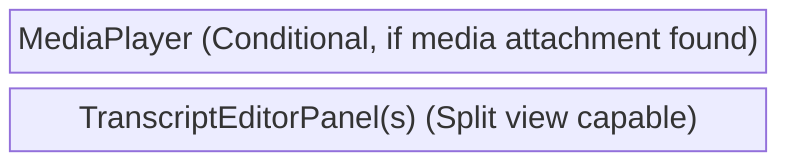
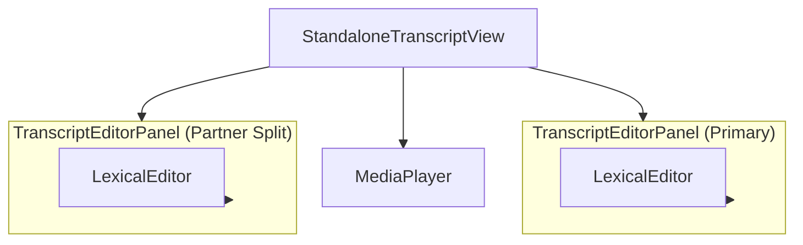

# Standalone Transcripts View Components (`standalone_transcripts/`)

**Purpose:** Renders, edits, and manages standalone transcript files (JSON) that may not be strictly tied to a primary media asset, supporting split-view comparisons and optional media playback if attachments exist.

## Visual Wireframe

## Component Architecture

## Props / Inputs

- **`StandaloneTranscriptView.svelte`**:
  - **`itemPath`** (`String | null`): The absolute path to the transcript file.
- **`TranscriptEditorPanel.svelte`**:
  - **`itemPath`** (`String | null`): The path of the specific transcript to load.
  - **`isPrimary`** (`Boolean`): Flags if this panel is the main view or a split partner.
  - **`enableSegmentPlayback`** (`Boolean`): Toggles click-to-play functionality on transcript segments.
  - **`highlightedRowIndex`** (`Number`): The row index to externally highlight/focus within the Lexical editor.

## State & Context (Svelte Stores)

- **Local State (`StandaloneTranscriptView`):** `mediaPath`, `attachments`, split-view row counts, and scroll sync toggles.
- **Global Stores:**
  - `$project` (`$lib/stores/projectStore.js`): Uses `standaloneTranscriptSplits` to determine if split-mode is active. Tracks dirty states (`isStandaloneTranscriptDirty`) and JSON content (`currentStandaloneTranscriptLexicalJson`).
  - `$isLexicalEditMode` (`$lib/stores/mediaEditorStore.js`): Controls whether the transcript is editable or strictly in read/highlight mode.
  - `$activeLayout` (`$lib/stores/layoutStore.js`): Passes layout preferences (e.g., 'Layout1' for Detailed Table, 'Layout2' for Segment Block) down to the editor wrappers.

## Backend & Database Interop (Tauri IPC)

- **Tauri Commands Triggered:**
  - `invoke('get_asset_metadata_command')` (in `StandaloneTranscriptView`): Retrieves custom fields (like media attachments) to conditionally mount the MediaPlayer.
  - `invoke('read_file_content')` (in `TranscriptEditorPanel`): Fetches the raw string content of the transcript file.
  - `invoke('load_lexical_highlights')` (in `TranscriptEditorPanel`): Fetches saved highlight data for the transcript.
  - (Implicitly via services): `saveStandaloneTranscriptContent` saves transcript and highlight modifications.
- **Data Flow:** `StandaloneTranscriptView` routes the `itemPath`. If metadata indicates a media attachment, it mounts `MediaPlayer`. It mounts one or two `TranscriptEditorPanel`s based on the global split state. When the panel loads the raw string content, it runs `isValidLexicalState` to check if the file is Lexical JSON. If not (e.g. an older array of segments), it triggers a headless Lexical conversion (`segmentsToLexicalTable`) before mounting the actual `LexicalEditor`.

## Child Components

- **`StandaloneTranscriptView.svelte`**: The core controller linking optional media playback to transcript rendering and managing split-screen scroll synchronization.
- **`TranscriptEditorPanel.svelte`**: A targeted wrapper for the Lexical editor specifically tuned for loading, converting, rendering, and saving standalone transcript JSON structures.
- **`MediaPlayer`** (`../shared/`): Optional shared media component for playback.

## Expected Behaviors & Edge Cases

- **Format Conversion:** If a standalone transcript is loaded and its JSON structure is just an array of segment objects (legacy format), `TranscriptEditorPanel` uses `@lexical/headless` to parse the HTML strings and programmatically generate a valid `@lexical/table` structure _before_ presenting it to the user.
- **Empty State Handling:** If a file is completely empty, it programmatically generates an empty Lexical table structure with standard headers ("#", "Time", "Speaker", "Text") to prevent a crash and allow immediate data entry.
- **Scroll Synchronization:** When a split view is active (two transcripts visible), the view attaches event listeners to both scrollable areas. Scrolling or clicking in one panel automatically scrolls the other to the matching row index. If row counts differ significantly, a warning banner is displayed.
- **Autosave Debouncing:** `handleEditorChange` debounces input by 300ms before dispatching the `jsonString` up to the global store, which the top bar monitors for autosaving.
- **Layout CSS Simulation:** The `$activeLayout` store injects CSS classes (`layout-Layout1`, `layout-Layout2`) into the panel wrapper. `Layout2` overrides the default `<table>` display properties in CSS to render the Lexical table rows as "Segment Blocks" (cards) instead of a traditional grid, hiding the index column and reflowing the speaker/time text.
