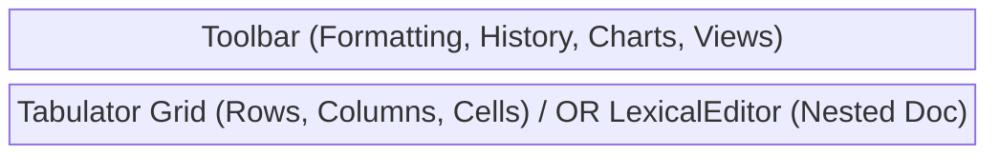
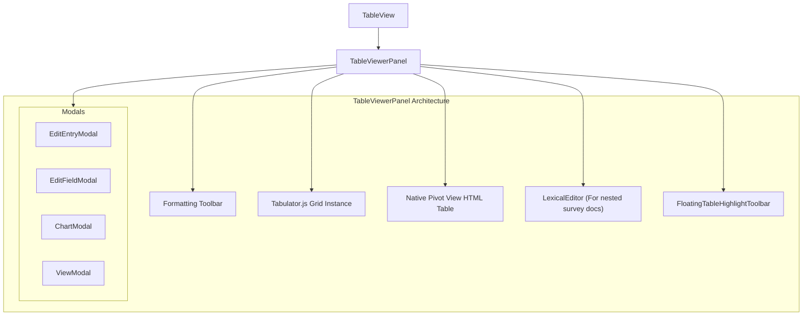

# Tables View Components (`tables/`)

**Purpose:** Renders and manages spreadsheet data (CSV/XLSX) utilizing `tabulator-tables` to provide an interactive grid with schema-aware formatting, cell/row highlighting, customizable data views (e.g., Pivot, Partial), and nested document attachments (Surveys).

## Visual Wireframe

## Component Architecture

## Props / Inputs
* **`TableView.svelte`**:
  * **`itemPath`** (`String | null`): The absolute path to the CSV/XLSX file.
  * **`hasHeaders`** (`Boolean`): Flags if the first row of the data represents schema headers.
  * **`activeSubItemPath`** (`String | null`): Path to a nested attachment (like a survey JSON doc) to open instead of the base table.
  * **`activeSubItemType`** (`String | null`): Dictates if the sub-item is a 'doc' or a 'view'.

## State & Context (Svelte Stores)
* **Local State (`TableViewerPanel`):**
  * `tableData`, `tableSchema`: The core dataset and structural definition driving Tabulator.
  * `tabulatorInstance`: The raw JS class instance of the grid.
  * `currentActiveView`, `currentActiveViewType`, `generatedPivotResult`: State managing non-base table displays.
  * `isViewingDocument`, `currentActiveDocumentJson`: State toggling the Tabulator instance off to display a nested Lexical document.
  * `tableStyles`, `invalidCells`, `duplicateIds`: Formatting and validation state mapped to cells/rows.
* **Global Stores:**
  * `$project` (`$lib/stores/projectStore.js`): Syncs `currentTableHighlights` across components (like `HighlightsPanel`).
  * `$isLexicalEditMode` (`$lib/stores/mediaEditorStore.js`): Toggles whether the grid is read-only or cells can be double-clicked to edit.

## Backend & Database Interop (Tauri IPC)
* **Tauri Commands Triggered:**
  * `invoke('load_table_views_command')` / `invoke('load_chart_configs_command')` (in `TableViewerPanel` via services): Fetches custom display states saved against the table.
  * `invoke('save_note_json')` / `invoke('load_note_json')` (in `TableViewerPanel`): Reads/writes nested JSON documents (e.g., from survey generation) directly within the table view.
  * `invoke('locate_in_finder')` (in `TableViewerPanel`): Opens a specific "Project Link" cell's file path natively.
  * (Implicitly via `projectService.js`): `loadTableData`, `saveTableData`, `saveTableSchema`, `loadTableSchema` perform heavy lifting via `fast-csv` or `calamine` in Rust.
* **Data Flow:** `TableView` mounts `TableViewerPanel`. The panel calls `loadTableData` and `loadTableSchema` to get arrays/objects, then passes them to `new Tabulator(...)`. When a cell is edited (`cellEdited` event), the panel debounces a call to `saveTableData` to rewrite the CSV/XLSX. If a user creates a view (e.g., a Pivot table), `TableViewerPanel` bypasses Tabulator, computes the pivot in JS, and renders a standard HTML `<table>`.

## Child Components
* **`TableViewerPanel.svelte`**: The massive orchestrator for the `tabulator-tables` library, handling custom editors (dates, progress bars, star ratings), context menus, and history (undo/redo).
* **`FloatingTableHighlightToolbar.svelte`**: A pop-over toolbar that appears when dragging across cells to apply color highlights or tags.
* **`EditEntryModal.svelte` / `EditFieldModal.svelte`**: Modals for editing a full row's data or altering a column's schema (type, format, options).
* **`ChartModal.svelte` / `ViewModal.svelte`**: Interfaces for configuring and saving specialized visual representations of the data.
* **`LexicalEditor.svelte`**: (Re-used) If a user clicks a "Survey Document" attachment linked to a table row, the grid hides and the Lexical editor mounts to edit that JSON file.

## Expected Behaviors & Edge Cases
* **Tabulator Focus Stealing:** To prevent Tabulator from stealing focus and interrupting typing during an active cell edit, the component uses `reformatAllRows()` instead of `redraw()` or `updateData()` when applying highlighting or validation CSS classes reactively.
* **Custom Editors:** Cells with schema `subType` 'Progress', 'Rating', or 'Date & Time' use custom-built DOM elements (sliders, SVG stars, Flowbite datepickers) mapped into Tabulator via the `editor` callback.
* **Nested Document Routing:** Because tables can generate their own documents (via "Surveys"), `TableViewerPanel` can act as a router. If `activeSubItemType === 'doc'`, it hides Tabulator and mounts a full `LexicalEditor` right over the grid space.
* **Hardware Copy/Paste:** The panel implements custom `keydown` listeners for `Cmd+C` / `Cmd+V` (and Undo/Redo) to interface with Tabulator's clipboard module and custom Svelte history stacks.
* **Pivot Table Rendering:** Tabulator does not support complex nested column grouping natively well enough for the app's pivot requirements, so `currentActiveViewType === 'pivot'` dynamically destroys Tabulator and builds a native `<thead>`/`<tbody>` structure using `traverseRowTree` recursive logic.
