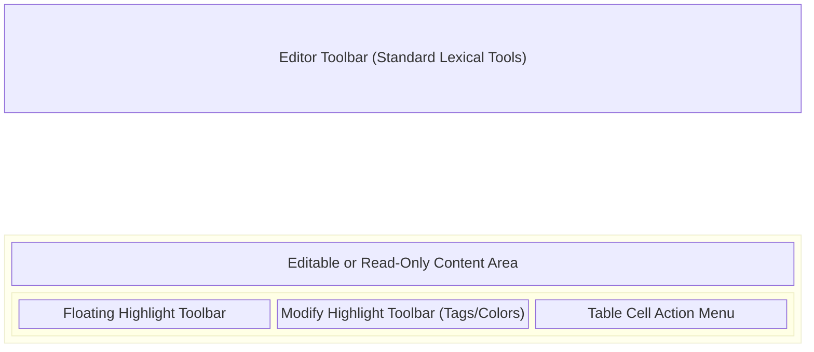
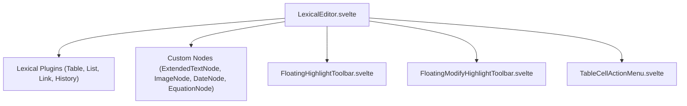

# Lexical Rich Text Editor

**Purpose:** Provides a highly customized, rich-text editor wrapper around Lexical.js to support custom nodes (highlights, images, equations, dates, nested tables) and read-mode annotations for the application.

## Visual Wireframe

## Component Architecture

## Props / Inputs

- **`contentJSON`** (`string`): The serialized Lexical document state loaded into the editor.
- **`editEnabled`** (`boolean`): Toggles between full rich-text editing mode and read-only mode.
- **`isTranscriptMode`** (`boolean`): If true, enables specialized text selection and read-mode highlighting functionality.
- **`docType`** (`string`): Defines the context of the document being edited (e.g., `'doc'`, `'table'`, `'standalone_transcript'`, `'audio_transcript'`).
- **`filePath`** (`string`): The relative path of the file being edited.

## State & Context (Svelte Stores)

- **Local State:** Manages the editor instance (`editor`), read-only state, floating menu positions (`toolbarPosition`, `menuPosition`), search/replace queries (`searchText`, `replaceText`), and active selections (`selectionRect`, `cellNodeKey`).
- **Global Stores:**
  - `$project`: Used to derive active document highlights, tags, and annotations (`currentDocumentHighlights`, `currentStandaloneTranscriptHighlights`, `currentTableHighlights`). Updates `isDocumentNoteDirty`, `isMediaNoteTranscriptDirty`, etc., for autosave triggers.
  - `$allTags`, `$allTagGroups`: Subscribed to populate the tagging dropdowns in the floating modify toolbar.

## Backend & Database Interop (Tauri IPC)

- **Tauri Commands Triggered:** None directly by these components; however, changes dispatch `change` events that prompt parent orchestrators to save Lexical JSON states via standard DB commands (e.g., `invoke('save_file_content')` or metadata updates).
- **Data Flow:** Lexical's internal state is serialized into JSON on the `update` cycle and emitted to the parent view via `on:change` events. Highlight events trigger `projectStore` updates which may independently persist.

## Child Components

- **`FloatingHighlightToolbar.svelte`:** Renders a floating selection popup (Flowbite Svelte) offering predefined color choices and a delete button for initially creating a highlight over selected text.
- **`FloatingModifyHighlightToolbar.svelte`:** Renders a floating toolbar for an _existing_ highlight. Includes tag assignment (Flowbite Dropdown/Checkbox), color alteration, and highlight deletion. Interfaces deeply with `$projectStore` and `$tagStore`.
- **`TableCellActionMenu.svelte`:** Context menu for nested Lexical tables. Allows inserting/deleting rows/columns, modifying cell/row/column background colors, and deleting the entire table structure.

## Expected Behaviors & Edge Cases

- **Read-Mode Highlighting:** When `editEnabled` is false but `isTranscriptMode` is true, users can still select text to trigger the `FloatingHighlightToolbar`. Clicking a color saves the highlight as an annotation into the global store without altering the fundamental Lexical document structure.
- **Tag Modification Dropdowns:** Inside `FloatingModifyHighlightToolbar`, dropdowns implement native HTML inputs with `autocomplete="off"`, `autocorrect="off"`, and `spellcheck="false"` to prevent browser interference during tag searches.
- **Autosave Intercept:** Svelte reactivity hooks intercept changes specifically targeting highlight IDs (via store methods like `toggleTagInHighlightLocal`) and immediately mark the respective store flag (e.g., `isDocumentNoteDirty = true`) to force the main View orchestrator to persist the changes.
- **Floating Positioning:** Floating toolbars rely on DOM `getBoundingClientRect()` relative coordinates. Scroll events and view resizes actively recalculate coordinates, though rapid scrolling may temporarily unalign menus before the Lexical update loop catches up.
