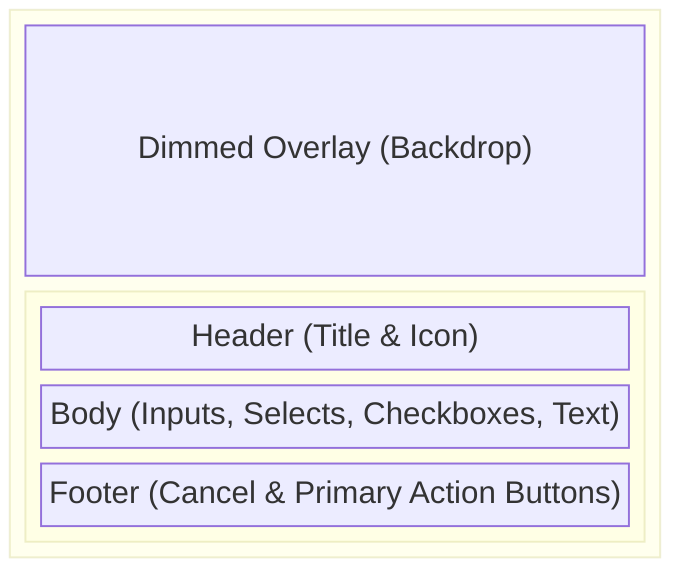
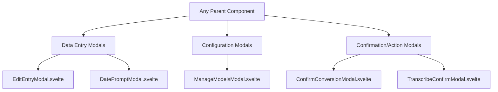

# Modals

**Purpose:** Houses all floating modal dialog components used across the `projectview` interface for configuration, confirmation, data entry, and feature execution.

## Visual Wireframe

## Component Architecture

## Props / Inputs

Most modals share a common activation prop, but context dictates the rest:

- **`showModal`** (`boolean`): Toggles the visibility of the modal. Typically bound (`bind:showModal`) to the parent.
- **Context-specific Props:** e.g., `rowData` and `schema` in `EditEntryModal.svelte` for rendering dynamic table forms, or `selectedFiles` in export modals.

## State & Context (Svelte Stores)

- **Local State:** Manages form input bindings, validation errors, and dropdown/datepicker visibility states.
- **Global Stores:**
  - `$project`: Accessed to fetch project assets (e.g., in `EditEntryModal.svelte` for Project Links) or current active context.
  - `$configStatusStore`: Accessed by machine learning or transcription modals (like `LiveTranscribeModelModal.svelte`) to verify Python dependencies (`python_libraries_installed`).

## Backend & Database Interop (Tauri IPC)

- **Tauri Commands Triggered:** Modals often invoke backend configuration fetchers directly (e.g., `getDownloadedModels()`, `getSelectedTranscriptionEngine()` via Svelte services) or delegate file-system mutations to the parent via dispatched events.
- **Data Flow:**
  1. User inputs data.
  2. Component validates.
  3. On confirm, component dispatches a Svelte event (e.g., `dispatch('confirm', { ...payload })`).
  4. Parent receives event and calls the necessary Tauri `invoke` commands.

## Child Components

This folder contains numerous specialized modals, including:

- **`EditEntryModal.svelte`:** Dynamic form generator for table row editing. Supports diverse data types (Dates, Times, Progress, Ratings, Lookups).
- **`LiveTranscribeModelModal.svelte`:** Configuration for real-time dictation, checking for ML models and dependencies before starting.
- **`ManageModelsModal.svelte`:** Sub-modal for downloading/configuring local LLM or Whisper models.
- **`ImageExportModal.svelte` / `DocumentExportModal.svelte`:** Configures export parameters (resolutions, formats).
- **`AddTagModal.svelte` / `CreateGroupModal.svelte`:** Simple text input dialogs for structural additions.

## Expected Behaviors & Edge Cases

- **Event Dispatching:** Modals operate on a standard Svelte dispatcher pattern (`on:close`, `on:cancel`, `on:confirm` or `on:save`). They do not mutate parent state directly unless strictly using `bind:`.
- **Z-Index Conflicts:** Modals use standard Flowbite z-indexes (e.g., `z-[10000]`). Nested popups inside modals (like Flowbite-Datepicker or custom time dropdowns) must use higher z-indexes (e.g., `z-[10002]`) to avoid being hidden behind the modal body.
- **Click Outside/Esc:** Configured with `outsideclose={true}` and `autoclose={false}` (handling close logic manually to prevent accidental data loss).
- **Validation:** Data entry modals (like `EditEntryModal.svelte`) validate input strictly against defined schemas, blocking the dispatch of the save event if errors exist.
