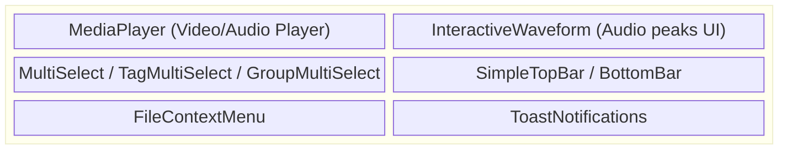
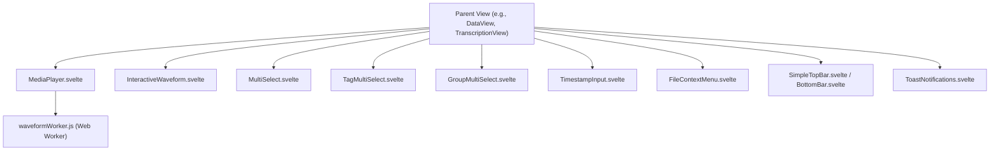

# Shared UI Components

**Purpose:** Provides highly reusable, standalone UI components that are shared across multiple specialized views (e.g., Data, Transcription, Tables) within the project interface.

## Visual Wireframe

## Component Architecture

## Props / Inputs

- **MediaPlayer/InteractiveWaveform:**
  - `explicitMediaPath` (`string`): Absolute path to the media file (used outside the global transcription store).
  - `isTrimming` / `isEditingSegment` (`boolean`): Toggles specific overlay UI loops and handles.
  - `externalAudioBuffer`, `externalPeaks` (`Float32Array`): Bypasses the global store for localized instances.
- **Dropdowns/Selects:**
  - `items` (`Array`): The data array for multiselects.
  - `value` (`Array`): Bound array of selected item IDs/strings.
- **Menus:**
  - `item` (`Object`), `x`, `y` (`number`): Context menu target and coordinates.

## State & Context (Svelte Stores)

- **Local State:** Intensive local state management exists within `MediaPlayer` (video bounds, playback rate, tooltip positioning) and `InteractiveWaveform` (zoom levels, pan offset, canvas resizing, ResizeObserver).
- **Global Stores:**
  - `$project`: Used to derive active project paths (e.g., for taking screenshots or fetching cached waveforms).
  - `$transcriptStore`: Subscribed to by `MediaPlayer` when acting as the primary transcription player (synchronizing `currentTime`, `duration`, `isPlaying`, and `selectedMediaFile`).

## Backend & Database Interop (Tauri IPC)

- **Tauri Commands Triggered:**
  - `invoke('save_screenshot')`: Captures and saves a base64 frame from the `MediaPlayer` video element.
  - `invoke('convert_srt_to_vtt_command')` / `convert_ass_to_vtt_command`: Real-time subtitle format conversion before blob URL injection.
  - `invoke('update_asset_metadata_command')`: Saves newly generated audio waveform peaks back into the SQLite DB to cache them.
- **Data Flow:** Web Workers (`waveformWorker.js`) handle heavy audio decoding and peak generation off the main thread. Once complete, `MediaPlayer` sets the peaks in Svelte stores and dispatches Tauri IPC to persist them to the database.

## Child Components

- **`MediaPlayer.svelte`:** A highly complex HTML5 `<video>` wrapper supporting custom controls, playback rates, screenshotting, subtitle injection, trimming loops, and Tauri keyboard shortcuts.
- **`InteractiveWaveform.svelte`:** Renders high-performance audio peaks using HTML5 `<canvas>`. Supports zooming, panning, auto-scrolling during playback, and draggable handles for trimming.
- **`FileContextMenu.svelte`:** A generic absolute-positioned floating menu used when right-clicking files in data trees or lists.
- **`MultiSelect.svelte`, `TagMultiSelect.svelte`, `GroupMultiSelect.svelte`:** Custom dropdown selection components featuring search, checkbox toggles, and dynamic DOM flipping to prevent screen clipping.
- **`TimestampInput.svelte`:** Validated input specifically for hours:minutes:seconds formats.
- **`ToastNotifications.svelte`:** Global floating toast container for app-wide messages.

## Expected Behaviors & Edge Cases

- **Web Worker Caching:** `MediaPlayer` attempts to fetch cached waveform peaks from the database via `getAssetMetadata` before spawning a Web Worker to decode the audio file.
- **Subtitles:** Native HTML `<track>` elements only support WebVTT. `MediaPlayer` intercepts `.srt` and `.ass` files, sending them to Rust for instant conversion before mounting them via `URL.createObjectURL()`.
- **Waveform Canvas Limitations:** Browsers have maximum canvas size limits. `InteractiveWaveform` uses a combination of logical coordinate scaling and a visible pixel buffer to simulate massive, zoomed-in timelines without crashing the browser's graphics renderer.
- **MultiSelect Flipping:** Dropdowns dynamically calculate viewport bounding boxes (`getBoundingClientRect()`) to flip upward (`transform: translateY(-100%)`) if the bottom of the screen intersects the menu.
