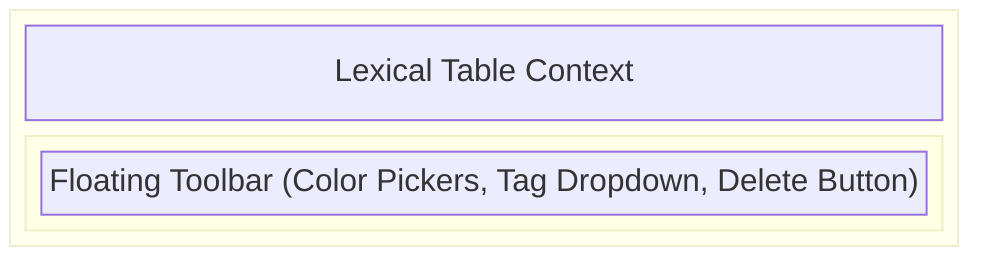
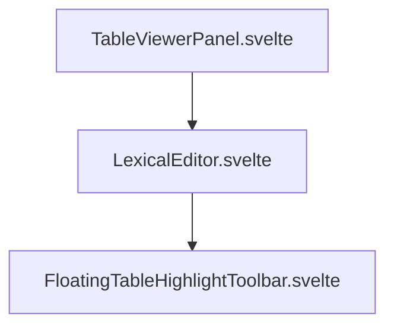

# Tables

**Purpose:** Houses UI components specific to Lexical table rendering and manipulation, primarily focusing on floating toolbars for editing table annotations.

## Visual Wireframe

## Component Architecture

## Props / Inputs

- **`showToolbar`** (`boolean`): Controls the visibility of the floating menu.
- **`toolbarPosition`** (`{ top: number, left: number }`): Determines the absolute coordinates to render the menu at, calculated dynamically relative to the browser viewport.
- **`highlightId`** (`string`): The unique ID of the specific highlight being targeted.
- **`docType`** (`string`): Defines the context (e.g., `'table'`, `'doc'`) so the correct Svelte store subset is checked for existing tags.
- **`filePath`** (`string`): The relative path of the table document.
- **Callbacks:** `onChangeColor`, `onDelete`, `onClose`, `onTagToggle` triggered by user interaction.

## State & Context (Svelte Stores)

- **Local State:** Manages the visibility of the internal tag search bar (`isSearchVisible`, `searchTerm`).
- **Global Stores:**
  - `$project`: Retrieves `currentTableHighlights` (based on `docType`) to pre-populate the active tags applied to this specific highlight.
  - `$allTags`, `$allTagGroups`: Subscribed to populate the nested dropdown lists of available global tags.
  - `toggleTagInHighlightLocal()`, `addTag()`: Store actions used to mutate the global state directly from the toolbar.

## Backend & Database Interop (Tauri IPC)

- **Tauri Commands Triggered:** None directly. Modifying a highlight dispatches store updates, which in turn sets flags (like `isTableHighlightDirty`) in parent orchestrators, prompting them to save data to the backend via `save_file_content`.
- **Data Flow:** Selecting a tag dispatches a store update. Once Svelte reactivity resolves the update, the parent Table View handles persistence.

## Child Components

- **`FloatingTableHighlightToolbar.svelte`:** A highly specialized derivation of the document floating highlight toolbar, explicitly mapped to handle table annotations (`docType === 'table'`) and their respective tags/colors.

## Expected Behaviors & Edge Cases

- **Dropdown Tag Search:** Users can filter tags dynamically. Using HTML5 standard `autocomplete="off"` prevents native browser dropdowns from obstructing the Flowbite UI.
- **Z-Index:** Set exceptionally high (`z-[100000]`) to ensure the floating toolbar appears over any nested scrolling containers, splitpanes, or Lexical block overlays.
- **Tag Modification in Read Mode:** Unlike `LexicalEditor.svelte` which alters internal JSON states, this component mutates the separate `$project` highlight array overlay.
