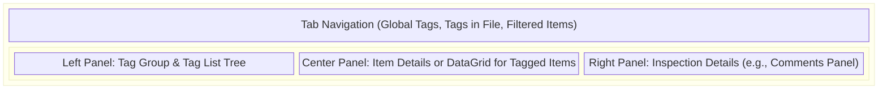
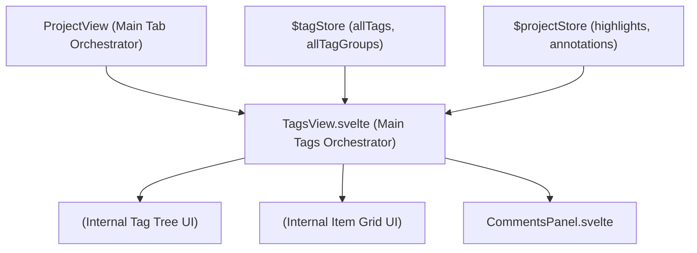

# Tags UI Components

**Purpose:** Provides the user interface components for managing, inspecting, and navigating through tags and comments across all project assets.

## Visual Wireframe

## Component Architecture

## Props / Inputs
* **`TagsView.svelte`**:
  * Inherits active scope context via Svelte stores, but acts as a root-level tab view.
* **`CommentsPanel.svelte`**:
  * `comments` (`Array`): A list of comment objects (`{ id, text, parentId, createdAt, updatedAt }`).
  * `highlightId` (`string`): The ID of the highlight/annotation these comments belong to.

## State & Context (Svelte Stores)
* **Local State:**
  * `TagsView.svelte` manages active tabs, selected tag contexts, search filters, and layout splits (via Svelte-Splitpanes).
  * `CommentsPanel.svelte` manages active editing states (`editingCommentId`, `editingText`), reply targets, and context menu visibility (`activeMenuId`).
* **Global Stores:**
  * `$tagStore` (`allTags`, `allTagGroups`): Used to render the global tree of available organizational tags.
  * `$project`: Used to aggregate highlights across `currentDocumentHighlights`, `currentPdfAnnotations`, etc., allowing users to find all assets associated with a selected tag.

## Backend & Database Interop (Tauri IPC)
* **Tauri Commands Triggered:**
  * `TagsView` utilizes backend search/filter APIs (e.g., `invoke('get_documents')`, `invoke('get_all_tags')`) indirectly via Svelte service wrappers to fetch tagged items on demand.
* **Data Flow:**
  * The Comments UI dispatches `addcomment`, `editcomment`, and `deletecomment` events containing the updated comment object or ID.
  * The parent view (like `TagsView` or `LexicalEditor`) catches these, updates the corresponding `$projectStore` highlight object, sets a "dirty" flag, and triggers an autosave cycle back to the SQLite DB.

## Child Components
* **`TagsView.svelte`:** A complex, multi-pane view for exploring the project's tag taxonomy. Features drag-and-drop support, extensive filtering, and deep linking (dispatching `requestviewchange` to jump to a specific highlight in its native view).
* **`CommentsPanel.svelte`:** A dedicated side-panel UI for rendering threaded conversations (parent comments and nested replies). Includes inline editing, hover menus for deletion, and keyboard shortcut support (e.g., `Cmd+Enter` to submit).

## Expected Behaviors & Edge Cases
* **Deep Linking (`requestviewchange`):** Clicking a highlight in `TagsView` dispatches a custom event to switch the main application tab (e.g., to 'Data' or 'Transcription') and focus the specific element. Memory indicates `highlightId` must be explicitly included in this payload.
* **Click Outside Menus:** The `CommentsPanel` utilizes an invisible fixed overlay (`div class="fixed inset-0 z-10" on:click={closeAllMenus}`) to cleanly handle clicking outside an active "More Options" dropdown menu.
* **Textarea Autocorrect:** As instructed by memory, custom inputs like `commentTextarea` explicitly implement `autocomplete="off"`, `autocorrect="off"`, and `spellcheck="false"` to prevent native browser text prediction interference.
