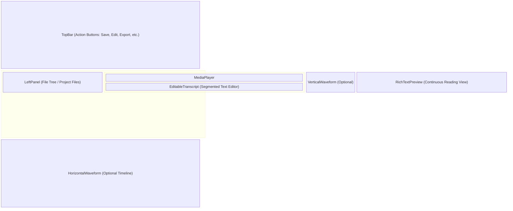
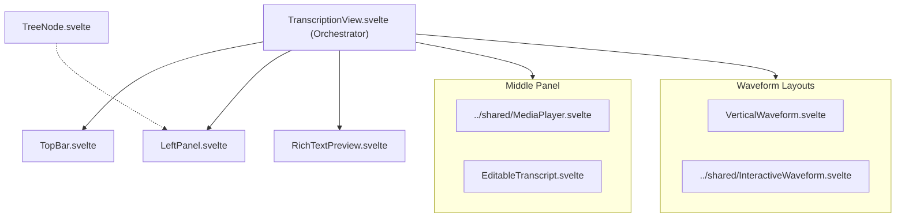

# Transcription UI Components

**Purpose:** Provides a dedicated, multi-pane view for reviewing, editing, and managing media transcriptions, synchronizing text segments with an interactive media player and audio waveforms.

## Visual Wireframe

## Component Architecture

## Props / Inputs

- **`TranscriptionView.svelte`**:
  - No direct props (acts as a root-level tab view). Relies entirely on global Svelte stores.
- **Child Components**:
  - `EditableTranscript` / `RichTextPreview`: Receive `panelEditMode` (`boolean`) to toggle between read-only and editable states.
  - Waveform components receive audio buffers, peak data, and active segment bounds.

## State & Context (Svelte Stores)

- **Local State:**
  - `TranscriptionView` manages layout split logic (`middlePanelWidthClass`, `rightPanelWidthClass`), current waveform layout (`horizontal`, `vertical`, `none`), edit mode state (`isLexicalEditMode`), and active segment editing bounds (`currentEditSegmentStart`, `currentEditSegmentEnd`).
- **Global Stores:**
  - `$transcriptStore`: The core source of truth for the entire view. Manages the active media file (`selectedMediaFile`), transcript segments, audio buffers, player state (`currentTime`, `duration`), and dirty (unsaved) flags.
  - `$panelStateStore`: Controls visibility of the left sidebar (`transcriptionPanelCollapsed`).
  - `$waveformLayoutStore`: Controls the visual placement of the waveform.

## Backend & Database Interop (Tauri IPC)

- **Tauri Commands Triggered:**
  - File loading and saving are handled by `projectService.js` (e.g., `saveTranscriptData`, `convertAndSaveTranscriptAsDoc`), which invoke Tauri commands to write modified JSON segmented data to `harvey_files/Transcripts`.
  - `findMediaByTranscriptRelativePath` derives media relationships to auto-load the correct video/audio when a transcript file is clicked in the `LeftPanel`.
- **Data Flow:**
  1. User selects media or transcript in `LeftPanel`.
  2. `loadRequestedItem` parses relationships and updates `$transcriptStore`.
  3. `MediaPlayer` decodes audio to Web Worker, returns peaks.
  4. `EditableTranscript` and `RichTextPreview` render JSON segments.
  5. Edits update the Svelte store and trigger a debounce save to the SQLite DB.

## Child Components

- **`TranscriptionView.svelte`:** The master layout orchestrator. Coordinates Svelte events between the media player, waveforms, and text editors.
- **`LeftPanel.svelte`:** Renders a tree view (via recursive `TreeNode.svelte`) of the project's `Audios`, `Videos`, and `Transcripts` folders.
- **`EditableTranscript.svelte`:** Renders individual transcription segments as editable blocks with timestamps and speaker tags.
- **`RichTextPreview.svelte`:** Renders the entire transcript as a continuous document, supporting Lexical rich-text editing, find/replace, and highlight tagging.
- **`VerticalWaveform.svelte`:** A specialized vertical canvas rendering audio peaks, allowing users to scroll through the media timeline intuitively.

## Expected Behaviors & Edge Cases

- **Syncing Edits:** Before changing the active segment or navigating away, `TranscriptionView` forces `EditableTranscript` to commit any pending Lexical edits (`commitCurrentSegmentEdits()`) to the global store to prevent data loss.
- **Dual Mode Deactivation:** If the user is in "Dual Transcript Mode" (e.g., translating) and clicks a new file in the left panel, the view proactively deactivates dual mode to prevent rendering collisions.
- **Waveform Resizing:** Changing the waveform layout (Horizontal vs. Vertical) recalculates CSS flexbox bounds. `horizontalWaveformContainerHeightPx` adapts dynamically to match the vertical panel width or defaults to 75px.
- **Jitter Prevention:** Edits to segments in `EditableTranscript` strictly update text within Svelte local component state, deferring heavy file-write saves to background debounce cycles to prevent UI blocking or Lexical cursor jumps.
