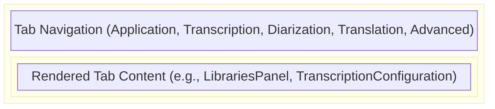
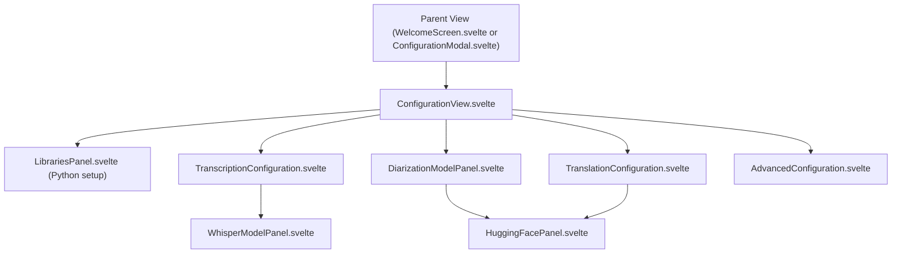

# Shared Components

**Purpose:** Houses highly reusable, top-level functional components—primarily focusing on the application configuration and settings panels—that are utilized by both the Welcome Screen and inside active projects.

## Visual Wireframe

## Component Architecture

## Props / Inputs

Most components in this folder act as root-level configuration orchestrators and rely on internal state or global stores rather than explicit props, with a few exceptions:

- **`HuggingFacePanel.svelte`**: Included within other panels to handle API token validation.
- **`WhisperModelPanel.svelte`**: Receives download locations and engine context to fetch the correct models.
- **`Dropdown.svelte`**: A generic headless UI dropdown component requiring `items` and a `bind:value`.

## State & Context (Svelte Stores)

- **Local State:** `ConfigurationView` tracks the `activeTab` and global busy states (`isTranscriptionBusy`, `isMovingModels`) to lock UI inputs across all panels during active downloads or filesystem operations.
- **Global Stores:**
  - `$configStatusStore`: The primary source of truth for the entire configuration flow. Subcomponents update this store to trigger reactivity across the application (e.g., determining if warning alerts should appear on the Welcome Screen).
  - `$themePreference`: Bound to the global theme dropdown to immediately toggle Light/Dark mode.

## Backend & Database Interop (Tauri IPC)

- **Tauri Commands Triggered:** Heavily utilizes `$lib/services/configureActions.js` which in turn invokes:
  - `get_config`, `set_config`: Reading and writing to the user's configuration file.
  - `move_models`: Invoked when the user changes the global download directory in `ConfigurationView.svelte`.
  - `check_python_libraries`: Triggered by `LibrariesPanel` to verify local pip installations.
- **Data Flow:** Configuration changes (like API keys or model paths) are written to the backend immediately via Tauri IPC, and the Svelte `$configStatusStore` is subsequently updated to reflect the new verified state.

## Child Components

- **`ConfigurationView.svelte`:** The master tab orchestrator.
- **`LibrariesPanel.svelte`:** Manages the installation and verification of required Python binaries (e.g., PyTorch, Transformers).
- **`TranscriptionConfiguration.svelte` / `TranslationConfiguration.svelte`:** Tab panels allowing users to select their preferred machine learning engines (e.g., Whisper.cpp vs. Faster-Whisper, NLLB vs. Helsinki) and manage downloaded models.
- **`HuggingFacePanel.svelte`:** Dedicated UI for entering, validating, and saving Hugging Face User Access Tokens, required for Diarization and some Translation models.
- **`AdvancedConfiguration.svelte`:** Handles deep backend settings like FFmpeg path overrides or hardware acceleration toggles.

## Expected Behaviors & Edge Cases

- **Moving Models:** In `ConfigurationView`, changing the `downloadLocation` triggers an OS-level file move for all currently downloaded models. The UI is locked (`isBusy = true`) across all tabs until this operation completes to prevent data corruption.
- **Dependency Alerts:** The tab navigation headers feature dynamic alert icons (`TriangleAlert`) that appear if `$configStatusStore` detects missing prerequisites for that specific feature (e.g., missing Python libraries for Diarization).
