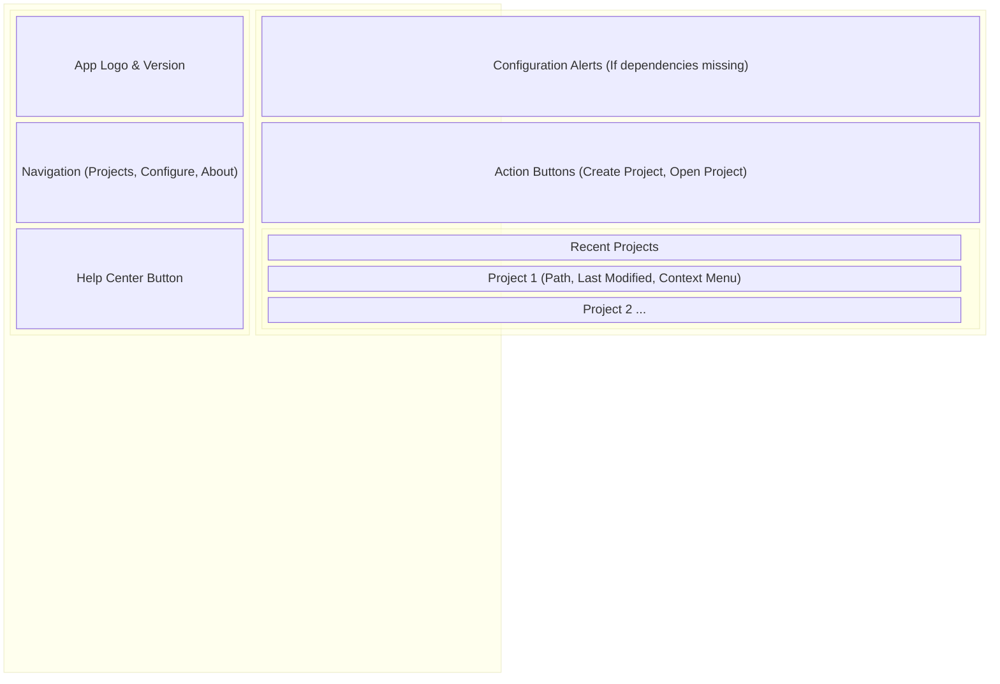
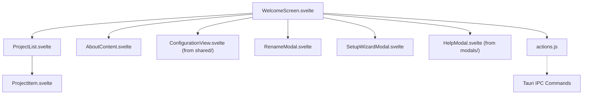

# Welcome Screen UI Components

**Purpose:** Provides the initial launch interface of the application, allowing users to create or open projects, view recent files, configure global application settings, and access the setup wizard or help center.

## Visual Wireframe

## Component Architecture

## Props / Inputs

- **`WelcomeScreen.svelte`:** Acts as the root view for the launch window. No direct props.
- **`ProjectList.svelte`:** Receives `recentProjects` (array of project objects) and `openMenuProjectPath` (string tracking active context menu).
- **`ProjectItem.svelte`:** Receives individual `project` data and dispatches events (`openRecent`, `toggleMenu`, `menuAction`).
- **`SetupWizardModal.svelte` / `RenameModal.svelte`:** Receive a `bind:showModal` boolean and context-specific data (e.g., `projectToRename`).

## State & Context (Svelte Stores)

- **Local State:** Manages the active navigation tab (`activeTab`), recent projects list (`recentProjects`), UI loading states, and modal visibility. State setter functions are explicitly passed down to `actions.js` for clean separation of concerns.
- **Global Stores:**
  - `$configStatus`: Crucial for the Welcome screen. Evaluates `python_libraries_installed`, `hf_token_present`, and downloaded AI models to conditionally render warning banners urging the user to complete the initial Setup Wizard.

## Backend & Database Interop (Tauri IPC)

- **Tauri Commands Triggered (via `actions.js`):**
  - `invoke('set_menu_context')`: Modifies the native OS menu bar options for the Welcome window.
  - `invoke('get_recent_projects')`: Fetches project history from SQLite.
  - `invoke('create_project_dialog')`, `invoke('open_project_dialog')`: Triggers native OS file dialogs.
  - `invoke('rename_project_command')`, `invoke('remove_recent_project_command')`: Mutates project records.
- **Data Flow:** `WelcomeScreen` sets up global Tauri event listeners (`listen('menu:file:new-project')`) to catch native OS menu clicks and route them to internal Svelte handlers.

## Child Components

- **`WelcomeScreen.svelte`:** The main orchestrator managing the sidebar tabs and routing to sub-views.
- **`ProjectList.svelte` / `ProjectItem.svelte`:** Renders the grid of recent projects, handling click-to-open and a `...` context menu (Rename, Remove from list, Reveal in File Explorer).
- **`AboutContent.svelte`:** Static informational page displaying version info and developer credits.
- **`SetupWizardModal.svelte`:** A multi-step modal guiding first-time users through installing Python dependencies, entering HuggingFace tokens, and downloading default machine learning models.
- **`actions.js`:** Extracts complex asynchronous logic (Tauri `invoke` calls and filesystem ops) out of the Svelte component. It utilizes dependency injection for Svelte state setter functions (e.g., `setRecentProjects`).

## Expected Behaviors & Edge Cases

- **Configuration Warnings:** If `$configStatus` indicates missing dependencies, a yellow alert banner appears dynamically at the top of the "Projects" tab containing a button to launch the `SetupWizardModal`.
- **Click Outside Handling:** Context menus on `ProjectItem` components are managed by a custom `handleClickOutside` event listener in `WelcomeScreen` to ensure only one menu is open at a time and clicks elsewhere dismiss it.
- **State Passing to JS modules:** Because `.js` files cannot reactively bind Svelte state, `WelcomeScreen` passes anonymous setter functions (e.g., `setRecentProjects`) into `actions.js` functions so the logic module can update the UI upon IPC completion.
