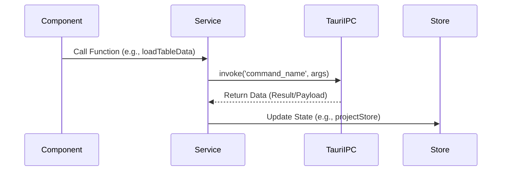

# Frontend Services (`src/lib/services`)

**Purpose:** Encapsulates complex business logic and acts as the primary API abstraction layer between the Svelte frontend components and the Tauri Rust backend.

## Interop Sequence

## Exported Functions

### `projectService.js`
Handles the core filesystem and database operations for projects.
*   **`refreshProjectFiles(projectId)`** -> `Promise<void>`: Refreshes the local file tree and updates `$project`.
*   **`saveTranscriptData(...)`** -> `Promise<void>`: Saves changes made in `EditableTranscript` to the backend.
*   **`requestTranscription(...)`** -> `Promise<void>`: Initiates the transcription background process.
*   **`loadTableData(...)`** / **`saveTableData(...)`** -> `Promise<Data>`: Reads/writes CSV/XLSX structures to/from the Rust backend.

### `configureActions.js`
Handles application-wide configuration logic.
*   **`getDownloadLocation()`** -> `Promise<String>`: Retrieves the saved path for downloaded AI models.
*   **`saveDownloadLocation(path)`** -> `Promise<void>`: Updates the global configuration file.
*   **`getDownloadedModels()`** -> `Promise<Array>`: Fetches the list of locally available ML models.
*   **`moveModelsAndUpdateLocation(newPath)`** -> `Promise<void>`: Invokes the backend to physically move heavy model files to a new directory.

## Tauri IPC / External API Calls

These services heavily utilize the `@tauri-apps/api/core` `invoke` function to call registered `#[tauri::command]` functions in Rust. Examples include `invoke('get_project_files')`, `invoke('save_file_content')`, and `invoke('set_config')`.

## Data Transformation

Services often normalize raw Rust structs or serialized JSON strings into JavaScript objects suitable for Svelte reactivity before injecting them into the stores. For example, dates might be parsed, or relational IDs might be mapped to corresponding objects.