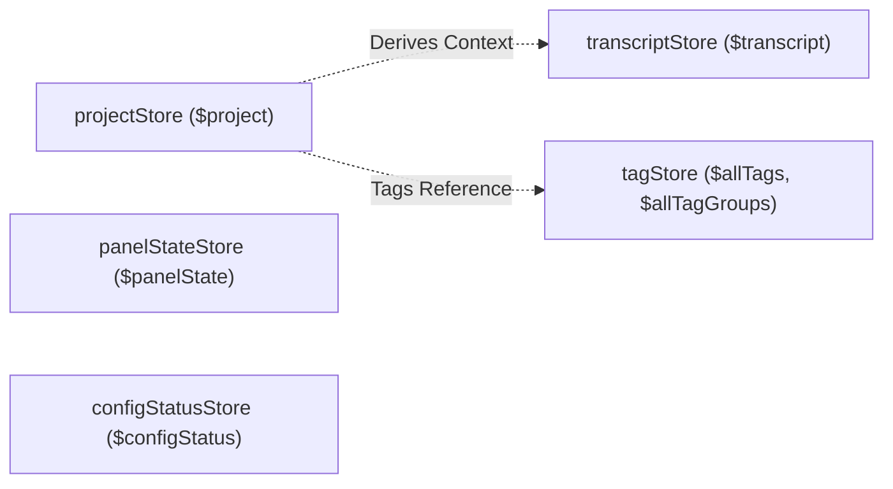

# Global Stores (`src/lib/stores`)

**Purpose:** Manages the centralized, reactive state for the entire Harvey application, ensuring data consistency across disparate UI components and tabs.

## Store Dependency Graph

## State Shape & Core Stores

- **`projectStore.js` (`$project`)**: The monolithic source of truth for an active project. Holds `id`, `xmlPath`, `baseDirectory`, `files` (the tree), and arrays for all annotations/highlights (`currentDocumentHighlights`, `currentTableHighlights`, etc.). Also manages global dirty flags (`isDocumentDirty`).
- **`transcriptStore.js` (`$transcriptStore`)**: Manages the highly complex state required for the transcription and media playback views. Contains `audioBuffer`, `segments`, `player` state (`currentTime`, `duration`, `isPlaying`), and manual/dual mode settings.
- **`panelStateStore.js` (`$panelStateStore`)**: Tracks UI layout states, such as whether sidebars (`dataLeftPanelCollapsed`, `infoPanelCollapsed`) are hidden or visible, and which contextual tab is active (`activeInfoPanelTab`).
- **`tagStore.js` (`$allTags`, `$allTagGroups`)**: Contains the global taxonomy available for the project.
- **`configStatusStore.js` (`$configStatus`)**: Tracks the installation status of required Python libraries and machine learning models, used globally to render warnings or block actions.

## Derived State

- Stores rarely use standard Svelte `derived` stores explicitly in this architecture; instead, they expose complex accessor/mutator functions (actions) that internally check conditions across the store payload before updating.

## Actions / Mutations

Each store exports explicit helper functions to mutate state safely, rather than components calling `.update()` directly in complex ways:

- **`projectStore.js`**:
  - `toggleTagInHighlightLocal(highlightId, tagName, docType, filePath)`: Maps a tag to a specific annotation and marks the document as dirty.
- **`transcriptStore.js`**:
  - `updatePlayerTime(time)`: Syncs the media player's timeline across all bound components.
  - `insertTranscriptSegment(index, newSegment)`: Modifies the `segments` array and flags the transcript as unsaved.
- **`tagStore.js`**:
  - `addTag(name)`: Pushes a new tag globally.

## Subscriptions / Effects

When `toggleTagInHighlightLocal` modifies a highlight array, it also synchronously flips a dirty flag (e.g., `isDocumentNoteDirty = true`). This change is subscribed to by TopBar components which utilize debounce timers to automatically trigger backend save services without manual user intervention.
