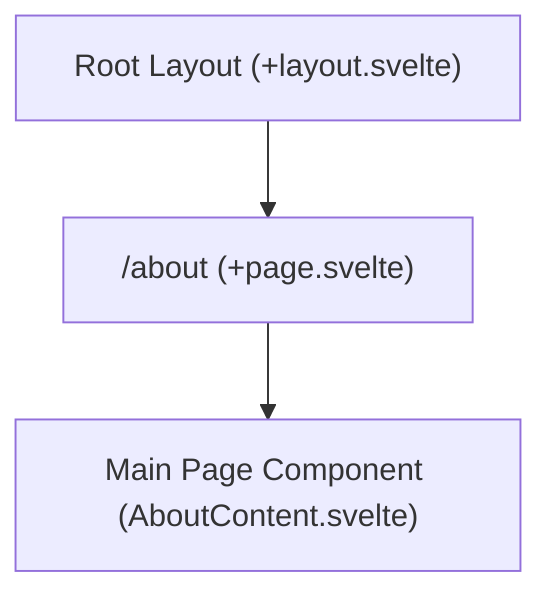

# Route: `/about` (`src/routes/about`)

**Purpose:** Renders the application's "About" page, displaying version information and legal credits.

## Routing & Layout

## Data Loading

No specific server-side data loading. The version string is typically fetched dynamically from the Tauri app API inside the Svelte component lifecycle (`onMount`).

## Top-Level Components

*   **`+page.svelte`**: The root Svelte page that orchestrates the layout.
*   **`AboutContent.svelte`**: A reusable component imported from `$lib/components/welcome/` that contains the text and styling.