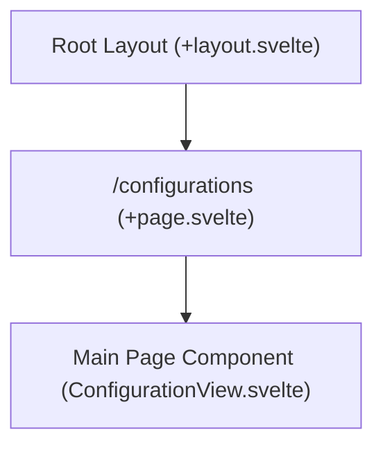

# Route: `/configurations` (`src/routes/configurations`)

**Purpose:** Serves as a dedicated, routable page for the application's global settings, allowing users to configure Python dependencies, download paths, and machine learning models outside of an active project view.

## Routing & Layout

## Data Loading

No server-side data loading (`+page.server.js`). The underlying Svelte components (`ConfigurationView`) rely on `onMount` calls to Tauri via IPC (e.g., `invoke('get_config')`) to populate the settings fields upon rendering.

## Top-Level Components

*   **`+page.svelte`**: The root routing wrapper that sets the page context.
*   **`ConfigurationView.svelte`**: The main interface imported from `$lib/components/shared/` containing the tabbed configuration panels.