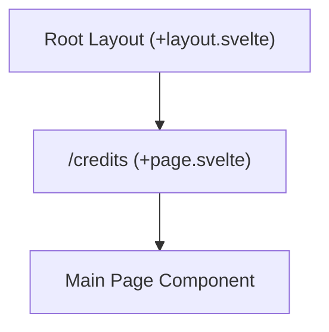

# Route: `/credits` (`src/routes/credits`)

**Purpose:** Displays attribution and licensing information for open-source libraries and assets used within the application.

## Routing & Layout

## Data Loading

This is primarily a static view. No dynamic data loading functions are utilized.

## Top-Level Components

*   **`+page.svelte`**: The standalone page component containing the credits text and layout structure.