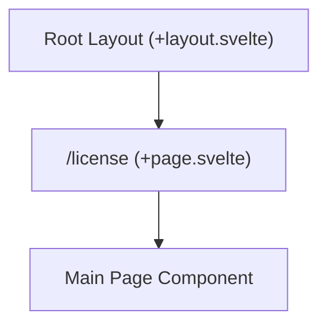

# Route: `/license` (`src/routes/license`)

**Purpose:** Renders the application's end-user license agreement or software license text.

## Routing & Layout

## Data Loading

This is primarily a static textual view. No server-side or dynamic data loading functions are executed before render.

## Top-Level Components

*   **`+page.svelte`**: The standalone page component formatting the legal license text.