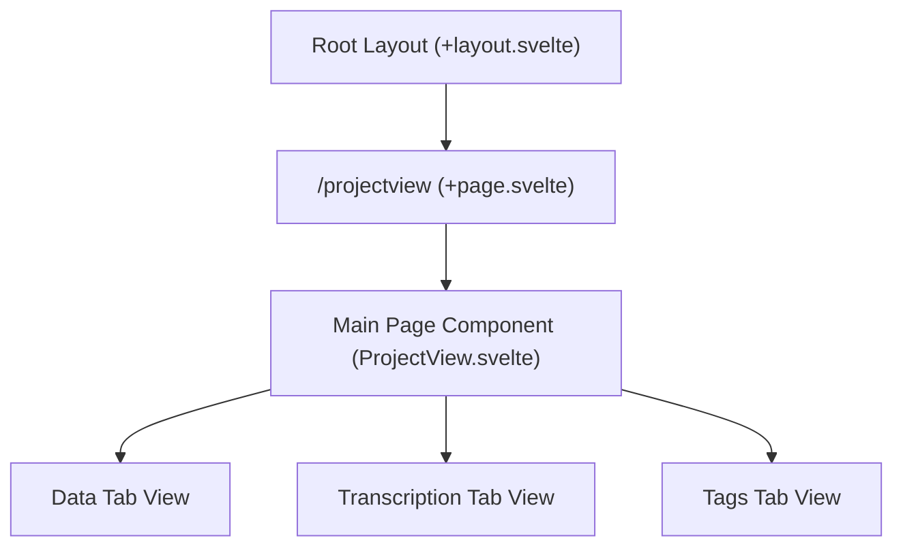

# Route: `/projectview` (`src/routes/projectview`)

**Purpose:** Acts as the primary container and master orchestrator for an active user project, managing the high-level tab navigation (Data, Transcription, Tags) and global project state.

## Routing & Layout

## Data Loading

When navigating to this route, Svelte's `onMount` within the `ProjectView.svelte` component (or the root `+page.svelte`) triggers a massive cascade of initializations via `projectService.js`:
*   `invoke('load_project_data')`: Fetches the core database structure and the `.harvey` manifest file.
*   `refreshProjectFiles()`: Initializes the local `projectStore` state.
*   `invoke('check_python_libraries')`: Ensures critical background systems are ready for the project's data.

## Top-Level Components

*   **`+page.svelte`**: The root Svelte page for this route.
*   **`ProjectView.svelte`**: The master orchestrator component. It renders a top-level tab bar and conditionally mounts large sub-view components (`DataView.svelte`, `TranscriptionView.svelte`, `TagsView.svelte`) imported from `$lib/components/projectview/` based on the user's active tab selection.
*   **`ProjectView.module.css`**: CSS Modules file specifically scoped to the `ProjectView` layout structure.