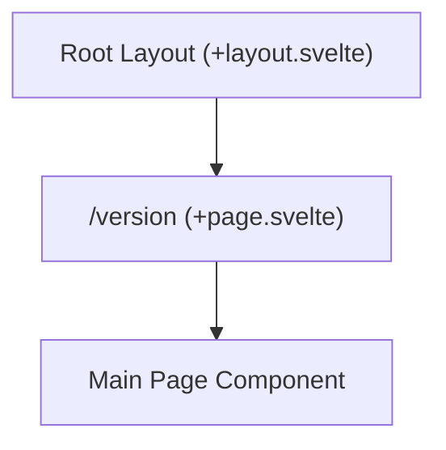

# Route: `/version` (`src/routes/version`)

**Purpose:** A utility or diagnostic route that programmatically surfaces the application's current build version, often used for debugging or update checks.

## Routing & Layout

## Data Loading

This view uses SvelteKit routing conventions, calling Tauri APIs on mount (like `getVersion()` from `@tauri-apps/api/app`) to display the version string to the user.

## Top-Level Components

*   **`+page.svelte`**: The simple page component orchestrating the version display logic.